## Daftar Isi

- [Pendahuluan](#pendahuluan)
- [Feature Searching](#feature-searching)
  - [Komponen Searching](#komponen-searching)
  - [Menjalankan Feature Searching](#menjalankan-feature-searching)
    - [Query Berdasarkan Title](#query-berdasarkan-title)
    - [Query Berdasarkan Text Body](#query-berdasarkan-text-body)
- [Query Scope](#query-scope)
  - [Cara Menggunakan Query Scope](#cara-menggunakan-query-scope)
  - [Implementasi Query Scope](#implementasi-query-scope)
- [When Method](#when-method)
  - [Efisiensi Isset](#efisiensi-isset)
- [Search Berdasarkan Category](#search-berdasarkan-category)
  - [Imeplementasi Feature Search Berdasarkan Category](#implementasi-feature-search-berdasarkan-category)
- [Search Berdasarkan Author](#search-berdasarkan-author)
  - [Implementasi Feature Search Berdasarkan Author](#implementasi-feature-search-berdasarkan-author)
- [Menghapus Route](#menghapus-route)
- [Feature Pagination](#feature-pagination)
  - [Cara Membuat Feature Pagination](#cara-membuat-feature-pagination)

## Pendahuluan

Pada pembahasan kali ini kita akan menambahkan 2 feature keren yaitu Searching dan Pagination. Searching ini nantinya akan kita lakukan untuk mencari postingan atau blog post berdasarkan keyword tertentu seperti berdasarkan judul, tulisan konten, kategori ataupun penulis nya sedangkan feature pagination akan kita gunakan untuk membatasi tampilan post di halaman kita sehingga nantinya kita tidak akan menampilkan semua postingan sekaligus, kita akan batasi per halamannya hanya beberapa postingan saja sehingga nantinya kita mempunyai halaman 2, 3, 4 dan seterusnya.

## Feature Searching

Kita akan menerapkan feature searching tersebut pada halaman `posts`, sehingga kita tambahkan terlebih dahulu komponen input dibawah heading untuk melakukan pencariannya. Untuk melakukannya kita buka terlebih dahulu file view nya di `posts.blade.php` dan untuk komponen nya kita bisa ambil dari dokumentasi bootstrap nya

> **Catatan**:
>
> Untuk kode `else` yang menampilkan tulisan `No post found.` kita pindahkan setelah div container post looping nya
>
> ```php
> @if ($posts->count())
>   ...
>   <div class="container">
>       <div class="row mb-5">
>           @foreach ($posts->skip(1) as $post)
>               ...
>           @endforeach
>       </div>
>   </div>
> @else
>   <p class="text-center fs-4">No post found.</p>
> @endif
> ```
>
> Agar nanti jika postingan nya tidak ada pada saat kita cari tidak ketemu, maka tulisan tersebut yang akan ditampilkan.

### Komponen Searching

Sekarang kita tambahkan komponen search nya menggunakan input-group dari bootstrap seperti berikut ini

> **Catatan**:
>
> Untuk attribute `method="GET"` pada element `form` itu kalian kosongkan juga tidak apa-apa karena default nya akan menggunakan Request `GET`.
>
> Pada element button terdapat attribute `type="submit"` itu berfungsi agar bisa jalan ketika kita tekan event `ENTER` pada keyboard.

```php
@extends('layouts.main')

@section('container')
    <h1 class="mb-3 text-center">{{ $title }}</h1>

    <div class="row justify-content-center mb-3">
        <div class="col-md-6">
            <form action="/posts" method="GET">
                <div class="input-group mb-3">
                    <input type="text" class="form-control" placeholder="Search.." name="search">
                    <button class="btn btn-danger" type="submit">Search</button>
                </div>
            </form>
        </div>
    </div>
```

Maka sekarang tampilan nya akan seperti gambar dibawah ini

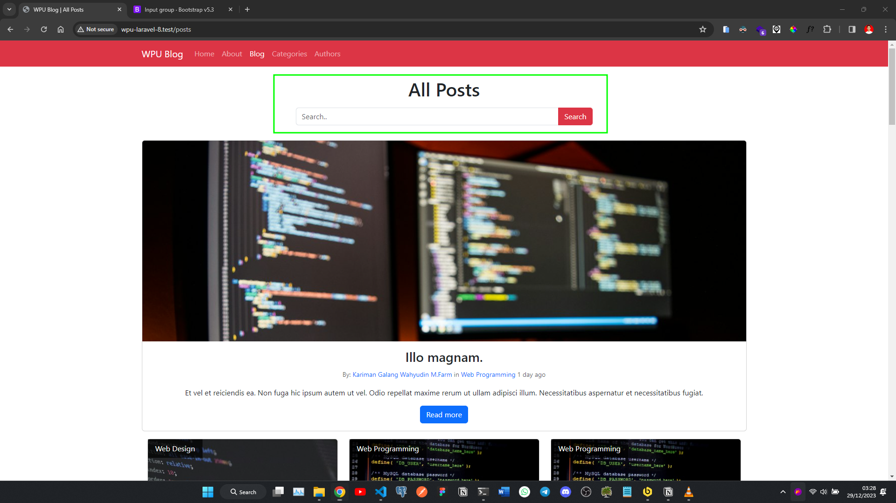

### Menjalankan Feature Searching

Setelah komponen nya sudah kita buat sekarang kita tinggal perlu menjalankan feature nya, sebelum kita tau bagaimana caranya, kita cari tau dulu bagaimana cara menangkap value dari komponen searching yang sudah kita buat sebelumnya.

Pada saat kita mengetikan sesuatu di komponen searching nya kemudian menekan tombol search nya, data akan dikirimkan ke halaman `posts` itu sendiri karena action nya mengarah ke route tersebut dan value dari input nya akan muncul di URL dengan format seperti ini `/posts?search=...` atau bisa kalian lihat gambar dibawah ini

> **Catatan**:
>
> `search` disini adalah dari attribute `name` pada element `input` nya


Nah bagaimana cara menangkap value tersebut? untuk menangkap nya kita bisa gunakan method yang namanya `request`, nah maka kita bisa tangkap di controller `PostController.php` nya karena action nya mengarah ke route tersebut, kita coba dump and die request search tersebut

```php
class PostController extends Controller
{
    public function index()
    {
        dd(request('search'));

        return view('posts', [
            "title" => "All Posts",
            "active" => "posts",
            "posts" => Post::latest()->get()
        ]);
    }

    ...
}
```

Maka sekarang harusnya muncul data tulisan apa yang kalian ketikan seperti gambar dibawah ini


Setelah kita mengetahui cara menangkap nya menggunakan method `request`, maka sekarang kita tinggal lakukan query, yang sebelumnya query nya seperti ini

```php
public function index()
{
    return view('posts', [
        "title" => "All Posts",
        "active" => "posts",
        "posts" => Post::latest()->get()
    ]);
}
```

#### Query Berdasarkan Title

Sekarang kita berikan kondisi apabila terdapat request search, maka tambahkan query `like` berdasarkan field `title` sebelum mendapatkan datanya, sehingga sekarang query nya menjadi seperti berikut ini

> **Catatan**:
>
> Method `where` ini jika kalian familiar menggunakan raw SQL, query nya akan seperti ini
>
> ```sql
> SELECT * FROM posts
> WHERE title LIKE '%value search%'
> ORDER BY created_at DESC
> ```

```php
public function index()
{
    $posts = Post::latest();

    if (request('search')) {
        $posts->where('title', 'like', '%' . request('search') . '%');
    }

    return view('posts', [
        "title" => "All Posts",
        "active" => "posts",
        "posts" => $posts->get()
    ]);
}
```

Sehingga sekarang jika kalian mencoba mencari postingan berdasarkan judul postingan maka akan muncul postingan berdasarkan judul yang kalian cari, namun jika kosong (`?search=`) maka akan muncul semua postingan seperti gambar berikut ini

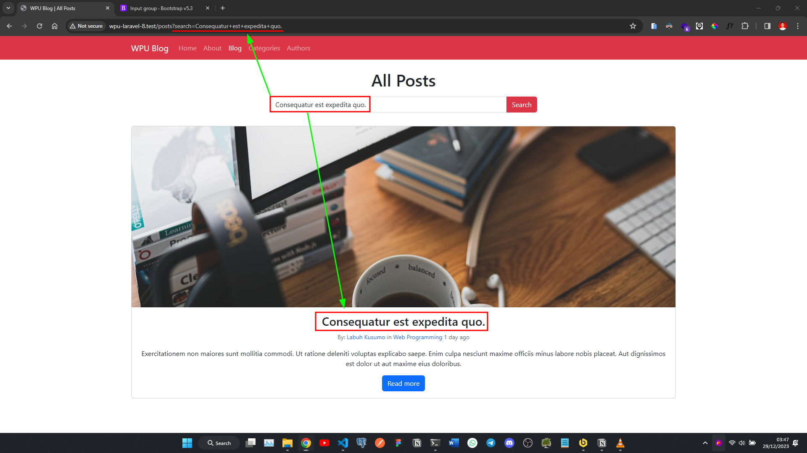

Jika kalian sadar terdapat agak sedikit kekurangan pada User Experince nya yang dimana jika kita melakukan searching, value dari form input nya ter-reset menjadi blank atau kosong kembali, bagus nya kita tetapkan value yang dicari pada form input nya agar user tau post apa yang dicari.

Untuk melakukannya cukup mudah yaitu menambahkan attribute `value` pada element input search nya, yang dimana isian dari attribute tersebut adalah request keyword yang dikirimkan ketika search nya

```php
<input type="text" class="form-control" placeholder="Search.." name="search" value="{{ request('search') }}">
```

#### Query Berdasarkan Text Body

Jika kalian ingin mencari selain dari title atau judul, misalkan berdasarkan text atau isian dari body postingan nya kita cukup tambahkan query `OR`, untuk melakukannya cukup mudah yaitu kita cukup melakukan chaining

```php
public function index()
{
    $posts = Post::latest();

    if (request('search')) {
        $posts->where('title', 'like', '%' . request('search') . '%')
            ->orWhere('body', 'like', '%' . request('search') . '%');
    }

    return view('posts', [
        "title" => "All Posts",
        "active" => "posts",
        "posts" => $posts->get()
    ]);
}
```

Nah, maka sekarang jika kalian isikan pada input search nya dengan isian konten body dari post nya, maka akan ter-filter atau ter-seleksi juga. Misalkan disini terdapat potongan kalimat `Perspiciatis pariatur sunt sit quibusdam.` pada salah satu postingan nya

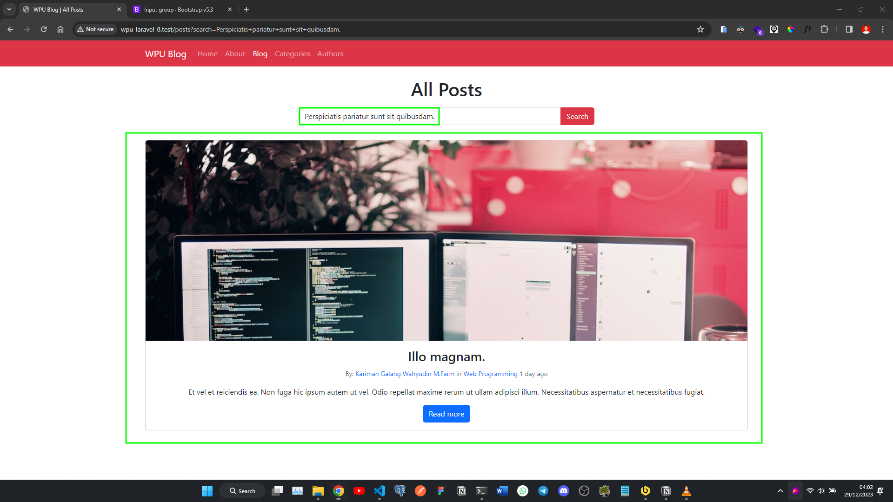

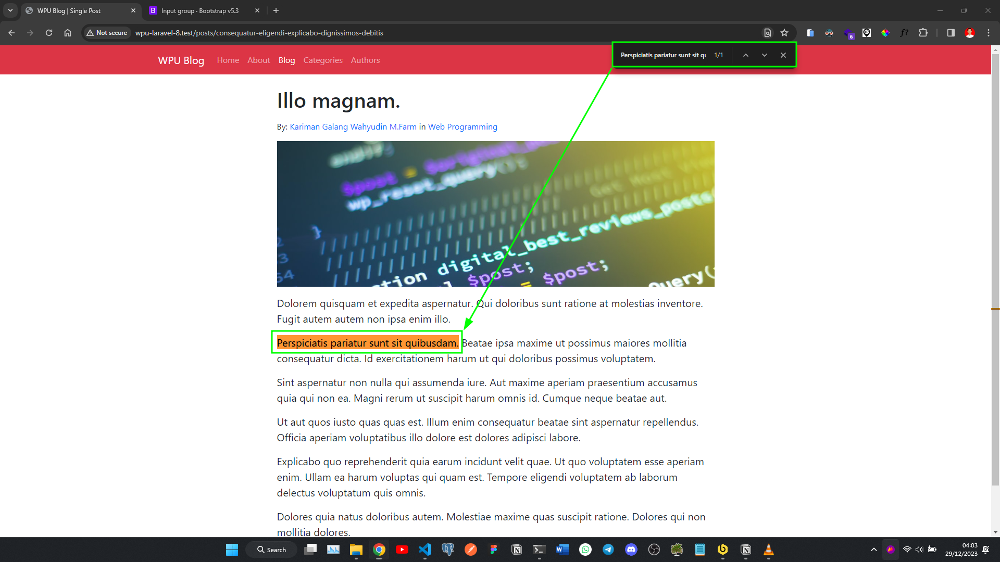

Cukup mudah bukan untuk feature search? Nah, sebetulnya hal tersebut akan kita perbaiki, kita perbaiki yang pertama adalah jika kita melakukan pencarian data seperti

```php
$posts = Post::latest();

if (request('search')) {
    $posts->where('title', 'like', '%' . request('search') . '%')
        ->orWhere('body', 'like', '%' . request('search') . '%');
}
```

Kemungkinan besar tugas nya model bukan tugasnya controller walaupun fitur nya jalan normal tidak ada error, maka sekarang kita tarik atau pindahkan kedalam model

## Query Scope

Sebelum kita melakukan pemindahan kode pencarian kedalam model, kita cari terlebih dahulu yang namanya `Query Scope`. Query Scope adalah feature dari Laravel atau lebih spesifik nya dari Eloquent agar kita bisa membuat sebuah filter kita sendiri. Kita disini akan menggunakan Query Scope yang `Local Scopes` yang dimana jika dikutip dari dokumentasi resmi Laravel nya adalah, dengan menggunakan local scopes itu memungkinkan kita untuk mendefinisikan query-query umum yang bisa kita gunakan kembali di dalam aplikasi kita. Sebagai contoh, misalkan kita membutuhkan untuk secara sering atau frequently retrieve mengambil data user yang kita anggap "populer".

### Cara Menggunakan Query Scope

Nah, bagaimana cara menggunakan nya? kita bisa tambahkan method didalam model dengan format nama method nya adalah `scopeNamaMethod`. Contohnya seperti berikut ini

```php
<?php

namespace App\Models;

use Illuminate\Database\Eloquent\Model;

class User extends Model
{
    /**
     * Scope a query to only include popular users.
     *
     * @param  \Illuminate\Database\Eloquent\Builder  $query
     * @return \Illuminate\Database\Eloquent\Builder
     */
    public function scopePopular($query)
    {
        return $query->where('votes', '>', 100);
    }

    /**
     * Scope a query to only include active users.
     *
     * @param  \Illuminate\Database\Eloquent\Builder  $query
     * @return void
     */
    public function scopeActive($query)
    {
        $query->where('active', 1);
    }
}
```

Nah jika sudah kita bikin didalam model, cara manggil method nya bagaimana? untuk cara nya cukup mudah yaitu kita panggil langsung didalam method nya

```php
use App\Models\User;

$users = User::popular()->active()->orderBy('created_at')->get();
```

### Implementasi Query Scope

Untuk implementasi nya kita buka file model post kita di `app/Models/Post.php` kemudian tambahkan method scope nya seperti berikut ini

```php
public function scopeFilter($query)
{
    if (request('search')) {
        return $query->where('title', 'like', '%' . request('search') . '%')
            ->orWhere('body', 'like', '%' . request('search') . '%');
    }
}
```

Nah jika sudah kita pindahkan proses filter query `like` nya ke model, sekarang kita perbaiki query dari `PostController.php` nya agar menggunakan method local scope yang sudah kita buat

```php
public function index()
{
    return view('posts', [
        "title" => "All Posts",
        "active" => "posts",
        "posts" => Post::latest()->filter()->get()
    ]);
}
```

Sekarang proses query data nya sudah berada di model, namun disini ada yang kurang rapih sedikit yaitu terdapat proses `request` di dalam method yang dimana sekarang kebalikan dari kasus sebelumnya, karena data itu kerjaan nya model sedangkan request kerjaan controller. Jika ingin memindahkan nya ke controller caranya kita cek apakah ada variabel atau property yang namanya search yang dikirim ke method `scopeFilter`.

Untuk kode yang lebih rapih nya seperti ini

```php
public function scopeFilter($query, array $filters)
{
    if (isset($filters['search']) ? $filters['search'] : false) {
        return $query->where('title', 'like', '%' . $filters['search'] . '%')
            ->orWhere('body', 'like', '%' . $filters['search'] . '%');
    }
}
```

Kemudian kita passing request search nya di controller ke method scopeFilter nya

```php
public function index()
{
    return view('posts', [
        "title" => "All Posts",
        "active" => "posts",
        "posts" => Post::latest()->filter(request(['search']))->get()
    ]);
}
```

## When Method

Nah sekarang kita akan lakukan efisiensi kode pada bagian kondisi `isset` nya menggunakan method collection di Laravel yang namanya `when`. Jika dikutip dari dokumentasi resmi Laravel nya, `when` method akan dijalankan ketika argument pertama bernilai `true` sehingga kita tidak perlu menggunakan `if` lagi. Jika bernilai `true` maka kita bisa ambil collection nya lalu kita lakukan sesuatu.

### Efisiensi Isset

When method ini sebetulnya hanya mengganti notasi saja dengan isset dan fungsi nya tetap sama, namun akan lebih ringkas jika kita sudah memiliki banyak. Sehingga yang sebelumnya seperti ini

```php
public function scopeFilter($query, array $filters)
{
    if (isset($filters['search']) ? $filters['search'] : false) {
        return $query->where('title', 'like', '%' . $filters['search'] . '%')
            ->orWhere('body', 'like', '%' . $filters['search'] . '%');
    }
}
```

Sekarang menjadi seperti ini

> **Catatan**:
>
> Syntax `??` disini merupakan feature dari php 7 yang namanya `Null Coaleascing Operator` yang dimana digunakan pada saat kita menggunakan ternary operator dan juga digunakan untuk pengecekan `isset()`. Sehingga yang sebelumnya seperti ini
>
> ```php
> isset($filters['search']) ? $filters['search'] : false
> ```
>
> Sekarang menjadi seperti ini
>
> ```php
> $filters['search'] ?? false
> ```

```php
public function scopeFilter($query, array $filters)
{
    $query->when($filters['search'] ?? false, function ($query, $search) {
        return $query->where('title', 'like', '%' . $search . '%')
            ->orWhere('body', 'like', '%' . $search . '%');
    });
}
```

## Search Berdasarkan Category

> **Catatan**:
>
> Problem ini terjadi ketika kita melakukan searching di route category atau author, yang terjadi jika ketika kita melakukan searching di route tersebut adalah kita dialihkan request nya ke `posts` lagi, sedangkan alangkah baiknya kita cari postingan berdasarkan judul yang user inginkan dan category nya yang user pilih, lihat gambar dibawah ini ketika melakukan searching di category `Web Design` namun judul post nya adalah yang ada di category `Web Programming` maka data nya akan tetap muncul karena search nya akan mencari ke semua post bukan spesifik category, seharusnya kan tidak relevan atau kurang spesifik pencariannya
>
> 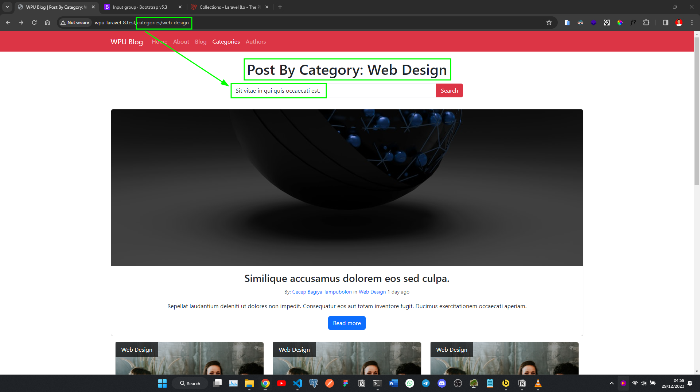
>
> 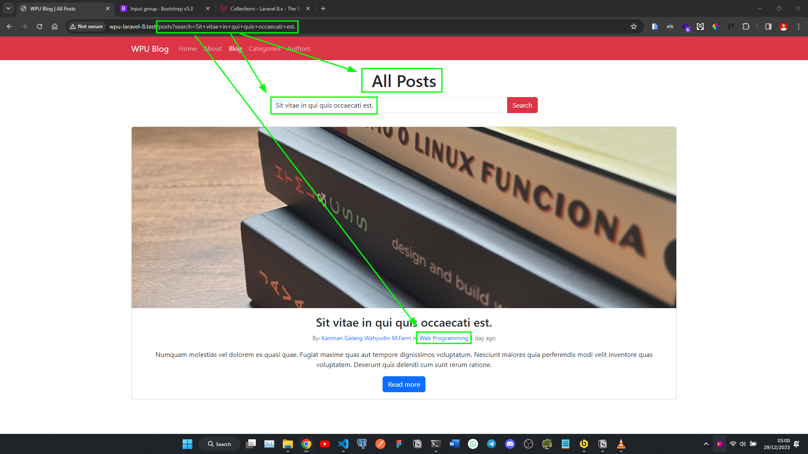

Untuk melakukannya, kita cukup tambahkan request baru pada `PostController.php` nya agar mengirimkan value category nya

> **Catatan**:
>
> `request(['search', 'category'])` disini nantinya akan membentuk format URL seperti berikut ini `/posts?search=...&category=...`

```php
public function index()
{
    return view('posts', [
        "title" => "All Posts",
        "active" => "posts",
        "posts" => Post::latest()->filter(request(['search', 'category']))->get()
    ]);
}
```

Kemudian kita tambahkan kondisi baru untuk query yang menangani request category tersebut di model nya

> **Catatan**:
>
> Query request category ini agak sedikit kompleks karena kita akan melakukan join table dari Post ke Category, sehingga akan mencari postingan dengan kriteria yang dicari tetapi dia juga merupakan bagian dari category.
>
> Nah untung nya Laravel disini sudah mempunyai sebuah method yang namanya `whereHas`, sehingga jika kita memiliki query yang memiliki relationship, misalkan belongsTo dari Post ke Category maka kita cukup gunakan seperti berikut ini
>
> ```php
>
> $query->whereHas('category', closure atau callback)
>
> public function category()
> {
>   return $this->belongsTo(Category::class);
> }
> ```

```php
public function scopeFilter($query, array $filters)
{
    ...

    $query->when($filters['category'] ?? false, function ($query, $category) {
        return $query->whereHas('category', function ($query) use ($category) {
            $query->where('slug', $category);
        });
    });
}
```

Nah setelah kita menambahkan filter berdasarkan category nya, sekarang masalah lainnya adalah kita tidak menggunakan request jika ingin mencari atau mem-filter berdasarkan category, melainkan kita menggunakan method didalam controller atau routes `categories/{categories:slug}`.


Query request filter berdasarkan category yang baru kita buat itu penulisan nya url nya seperti ini `/posts?category={category:slug}`


Nah sekarang kerennya adalah, jika sudah bisa menggunakan request filter berdasarkan category melalui GET seperti hal diatas, maka kita bisa gabungkan filter nya dengan filter lain yang sudah kita buat pada method local scope sebelumnya

```php
public function scopeFilter($query, array $filters)
{
    $query->when($filters['search'] ?? false, function ($query, $search) {
        return $query->where('title', 'like', '%' . $search . '%')
            ->orWhere('body', 'like', '%' . $search . '%');
    });

    $query->when($filters['category'] ?? false, function ($query, $category) {
        return $query->whereHas('category', function ($query) use ($category) {
            $query->where('slug', $category);
        });
    });
}
```

Maka sekarang kita bisa filter berdasarkan title dan text body pada bagian name search dan juga pada bagian name category, sehingga bentuk url nya akan seperti berikut ini

| No  | Format Request                                        |
| --- | ----------------------------------------------------- |
| 1   | `/posts?search={post:title}&category={category:slug}` |
| 2   | `/posts?search={post:body}&category={category:slug}`  |
| 3   | `/posts?category={category:slug}&search={post:title}` |
| 4   | `/posts?category={category:slug}&search={post:body}`  |

Contoh disini saya akan mencari postingan berdasarkan category dengan slug `web-programming` dan berdasarkan post title nya `Illo magnam.`


Sehingga kita bisa cari berdasarkan 2 filter sehingga menjadi lebih relevan gara-gara kita menggunakan method `when`. Jika kita coba lihat query nya pada clockwork, maka query yang dihasilkan harusnya seperti ini


Nah namun feature yang sudah kita buat tersebut belum kita implementasikan, karena saat ini hanya berjalan melalui URL nya saja sehingga jika kita coba melakukan search di halaman `/categories/{category:slug}` filter yang akan jalan hanya search berdasarkan title dan body post nya saja

### Implementasi Feature Search Berdasarkan Category

Untuk mengimplementasikannya kita perlu mengganti semua link atau anchor nya agar tidak lagi mengarah ke route category dan juga kita harus mengirimkan data category di URL nya.

Pertama kita perbaiki dulu link atau anchor category nya di file `posts.blade.php` pada bagian hero post dan juga loop post nya

> **Catatan**:
>
> Perhatikan href pada element anchor nya, yang sebelumnya seperti ini
>
> ```php
> /categories/{{ $posts[0]->category->slug }}
> ```
>
> Menjadi
>
> ```php
> /posts?category={{ $posts[0]->category->slug }}
> ```

```php
// Hero Section
<div class="card mb-3">
    ...
        ...
            <small class="text-body-secondary">
                ...
                in <a href="/posts?category={{ $posts[0]->category->slug }}" class="text-decoration-none">{{ $posts[0]->category->name }}</a> {{ $posts[0]->created_at->diffForHumans() }}
            </small>
        ...

        ...
    ...
</div>

// Loop Section
< class="container">
    ...
        @foreach ($posts->skip(1) as $post)
            ...
                ...
                    ...
                        <a href="/posts?category={{ $post->category->slug }}" class="text-white text-decoration-none">
                            {{ $post->category->name }}
                        </a>
                    ...
                ...
            ...
        @endforeach
    ...
</div>
```

Selantjutnya kita sisipkan category nya pada form pencariannya sehingga sekarang ketika kita melakukan search di spesifik category, filter nya akan lebih spesifik yaitu cari post berdasarkan category yang dipilih dan cari post berdasarkan title atau post yang dicari

```php
<form action="/posts" method="GET">
    @if (request('category'))
        <input type="hidden" name="category" value="{{ request('category') }}">
    @endif
    <div class="input-group mb-3">
        <input type="text" class="form-control" placeholder="Search.." name="search" value="{{ request('search') }}">
        <button class="btn btn-danger" type="submit">Search</button>
    </div>
</form>
```

Sekarang tugas lainnya adalah kita perlu mengubah semua anchor yang tadinya mengarah ke route `/categories/...` kita ganti agar mengarah ke request di route `/posts?category=...`. Misalkan pada file `post.blade.php` terdapat category

```php
<p>By:
    ...
    in
    <a href="/posts?category={{ $post->category->slug }}" class="text-decoration-none">
        {{ $post->category->name }}
    </a>
</p>
```

## Search Berdasarkan Author

Untuk melakukannya, kita cukup tambahkan request baru pada `PostController.php` nya agar mengirimkan value author nya

```php
public function index()
{
    return view('posts', [
        "title" => "All Posts",
        "active" => "posts",
        "posts" => Post::latest()->filter(request(['search', 'category', 'author']))->get()
    ]);
}
```

Kemudian kita tambahkan kondisi baru untuk query yang menangani request author tersebut di model nya

```php
public function scopeFilter($query, array $filters)
{
    ...

    $query->when($filters['author'] ?? false, fn($query, $author) =>
        $query->whereHas('author', fn($query) =>
            $query->where('username', $author)
        )
    );
}
```

Maka sekarang kita mempunyai 3 filter pada method local scope nya, yaitu:

- Filter berdasarkan search title dan body post
- Filter berdasarkan category
- Filter berdasarkan author

```php
public function scopeFilter($query, array $filters)
{
    // Versi isset
    //if (isset($filters['search']) ? $filters['search'] : false) {
    //return $query->where('title', 'like', '%' . $filters['search'] . '%')
    //    ->orWhere('body', 'like', '%' . $filters['search'] . '%');
    //}

    $query->when($filters['search'] ?? false, function ($query, $search) {
        return $query->where('title', 'like', '%' . $search . '%')
            ->orWhere('body', 'like', '%' . $search . '%');
    });

    // Versi Callback atau Closure
    $query->when($filters['category'] ?? false, function ($query, $category) {
        return $query->whereHas('category', function ($query) use ($category) {
            $query->where('slug', $category);
        });
    });

    // Versi Arrow Function
    $query->when($filters['author'] ?? false, fn($query, $author) =>
        $query->whereHas('author', fn($query) =>
            $query->where('username', $author)
        )
    );
}
```

Jika kalian coba sekarang mencoba menjalankannya melalui URL dengan format `/posts?author={user:username}&search={post:title}` maka akan muncul postingan dengan title yang dicari dan author dengan username yang dicari.

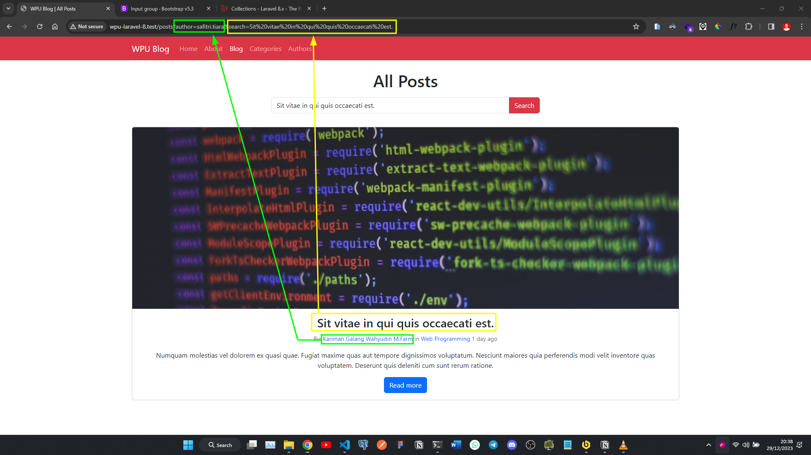

Nah namun feature yang sudah kita buat tersebut belum kita implementasikan, karena saat ini hanya berjalan melalui URL nya saja sehingga jika kita coba melakukan search di halaman `/authors/{author:username}` filter yang akan jalan hanya search berdasarkan title dan body post nya saja

### Implementasi Feature Search Berdasarkan Author

Untuk mengimplementasikannya kita perlu mengganti semua link atau anchor nya agar tidak lagi mengarah ke route author dan juga kita harus mengirimkan data author di URL nya.

Pertama kita perbaiki dulu link atau anchor author nya di file `posts.blade.php` pada bagian hero post dan juga loop post nya

> **Catatan**:
>
> Perhatikan href pada element anchor nya, yang sebelumnya seperti ini
>
> ```php
> /authors/{{ $posts[0]->author->username }}
> ```
>
> Menjadi
>
> ```php
> /posts?author={{ $posts[0]->author->username }}
> ```

```php
// Hero Section
<div class="card mb-3">
    ...
        ...
            <small class="text-body-secondary">
                By: <a href="/posts?author={{ $posts[0]->author->username }}" class="text-decoration-none">{{ $posts[0]->author->name }}</a>
                ...
            </small>
        ...

        ...
    ...
</div>

// Loop Section
<div class="container">
    ...
        @foreach ($posts->skip(1) as $post)
            ...
                ...
                    ...
                        <div class="card-body">
                            ...
                                <small class="text-body-secondary">
                                    By: <a href="/posts?author={{ $posts[0]->author->username }}" class="text-decoration-none">{{ $post->author->name }}</a>...
                                </small>
                            ...
                        </div>
                    ...
                ...
            ...
        @endforeach
    ...
</div>
```

Sekarang pada file single post nya yaitu di `post.blade.php`

```php
<p>By:
    <a href="/posts?author={{ $post->author->username }}" class="text-decoration-none">
        {{ $post->author->name }}
    </a>
    in
    ...
</p>
```

Selantjutnya kita sisipkan author nya pada form pencariannya sehingga sekarang ketika kita melakukan search di spesifik author, filter nya akan lebih spesifik yaitu cari post berdasarkan author yang dipilih dan cari post berdasarkan title atau post yang dicari

```php
<form action="/posts" method="GET">
    @if (request('category'))
        <input type="hidden" name="category" value="{{ request('category') }}">
    @endif
    @if (request('author'))
        <input type="hidden" name="author" value="{{ request('author') }}">
    @endif
    <div class="input-group mb-3">
        <input type="text" class="form-control" placeholder="Search.." name="search" value="{{ request('search') }}">
        <button class="btn btn-danger" type="submit">Search</button>
    </div>
</form>
```

Maka sekarang feature nya sudah berjalan

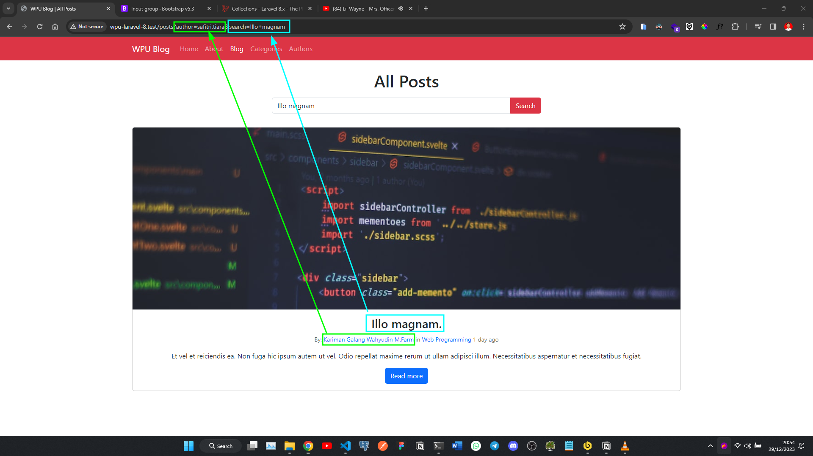

Sedikit informasi, pada tahap ini kita bahkan bisa menambahkan filter category sekaligus misalkan `/posts?author={user:username}&search={post:title}&category={category:slug}`

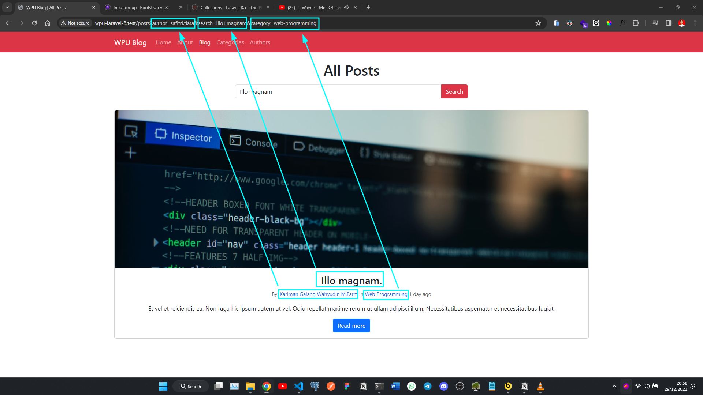

Dan query nya pasti akan panjang jika kita lihat pada clockwork


## Menghapus Route

Nah sekarang kita tidak butuh lagi route `/categories/{category:slug}` dan juga `/authors/{user:username}` karena bisa kita alihkan ke route `/posts?category={category:slug}` dan `/posts?author={user:username}`. Untuk memulainya kita ubah terlebih dahulu pada view yang menggunakan anchor ke route tersebut misalkan disini file `categories.blade.php` dan `authors.blade.php`

```php
@extends('layouts.main')

@section('container')
    <h1 class="mb-5">Post Categories</h1>

    <div class="container">
        <div class="row">
            @foreach ($categories as $category)
                <div class="col-md-4">
                    <a href="/posts?category={{ $category->slug }}" class="text-decoration-none">
                        <div class="card text-bg-dark">
                            name }}" class="card-img" alt="{{ $category->name }}">
                            <div class="card-img-overlay d-flex align-items-center p-0">
                                <h5 class="card-title text-center flex-fill p-4 fs-3" style="background-color: rgba(0, 0, 0, 0.7)">
                                    {{ $category->name }}
                                </h5>
                            </div>
                        </div>
                    </a>
                </div>
            @endforeach
        </div>
    </div>
@endsection
```

```php
@extends('layouts.main')

@section('container')
    <h1 class="mb-5">Authors</h1>

    @foreach ($authors as $author)
        <ul>
            <li>
                <h2>
                    <a href="/posts?author={{ $author->username }}" class="text-decoration-none">{{ $author->name }}</a>
                </h2>
            </li>
        </ul>
    @endforeach
@endsection
```

Namun sekarang masalah lainnya adalah tulisan heading di file `posts.blade.php` nya static hanya `All Posts` (seharusnya disesuaikan dengan filter nya). Cara mengatasi nya kita cukup akalin saja pada `PostController.php` nya agar mengirim dinamis title nya

```php
public function index()
{
    $title = '';

    if (request('category')) {
        $category = Category::firstWhere('slug', request('category'));
        $title = ' in ' . $category;
    }

    if (request('author')) {
        $author = User::firstWhere('username', request('author'));
        $title = ' by ' . $author;
    }

    return view('posts', [
        "title" => "All Posts" . $title,
        "active" => "posts",
        "posts" => Post::latest()->filter(request(['search', 'category', 'author']))->get()
    ]);
}
```

Selanjutnya kita hapus route nya yang mengarah ke `/categories/{category:slug}` dan juga `/authors/{user:username}` karena sudah tidak digunakan di file `web.php`

```php
Route::get('/categories/{category:slug}', [CategoryController::class, 'show']);
Route::get('/authors/{author:username}', [AuthorController::class, 'show']);
```

## Feature Pagination

Selanjutnya kita tambahkan satu feature lagi yang seharusnya itu kompleks dan lama namun karena Laravel sudah memudahkan ini bisa dibuat dengan cepat karena benar-benar magic, feature nya apa? ya betul Feature Pagination.

### Cara Membuat Feature Pagination

Untuk membuatnya kita cukup panggil method `paginate`, sebelumnya kita menggunakan method `get` nah sekarang kita ganti dengan method `paginate` dengan memasukkan parameter ingin berapa data per halaman nya di file `PostController.php`

```php
public function index()
{
    $title = '';

    if (request('category')) {
        $category = Category::firstWhere('slug', request('category'));
        $title = ' in ' . $category->name;
    }

    if (request('author')) {
        $author = User::firstWhere('username', request('author'));
        $title = ' by ' . $author->name;
    }

    return view('posts', [
        "title" => "All Posts" . $title,
        "active" => "posts",
        "posts" => Post::latest()->filter(request(['search', 'category', 'author']))->paginate(7)
    ]);
}
```

Sekarang jika kita arahkan ke route `/posts?page=2` maka data nya sudah berada di halaman ke 2, pertanyannya bagaimana cara menambahkan link komponen nya? Untuk menambahkannya lebih gampang lagi, kita cukup tambahkan method `links` pada collection di file view `posts.blade.php` seperti berikut ini

```php
@extends('layouts.main')

@section('container')

    ...
    @if ($posts->count())
        ...
    @else
        ...
    @endif

    {{ $posts->links() }}

@endsection
```

Maka sekarang bisa kalian lihat akan muncul komponen link nya, namun disini bentuk nya tidak beraturan dan rapih karena default styling dari Laravel adalah menggunakan TailwindCSS sedangkan kita menggunakan bootstrap, bagaimana cara agar style yang digunakan dari bootstrap?

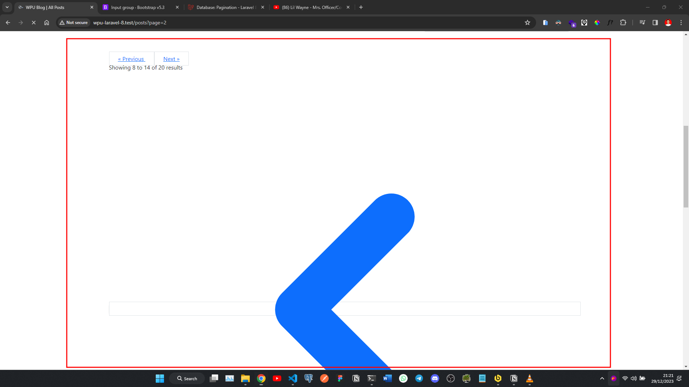

Untuk menggunakan styling bootstrap pada pagination nya, kita tinggal pergi ke file `App\Providers\AppServiceProvider` kemudian tambahkan kode berikut ini didalam method `boot`

```php
use Illuminate\Pagination\Paginator;

public function boot()
{
    Paginator::useBootstrap();
}
```

Sekarang jika kalian lihat kembali ke halaman nya, maka styling nya sudah rapih

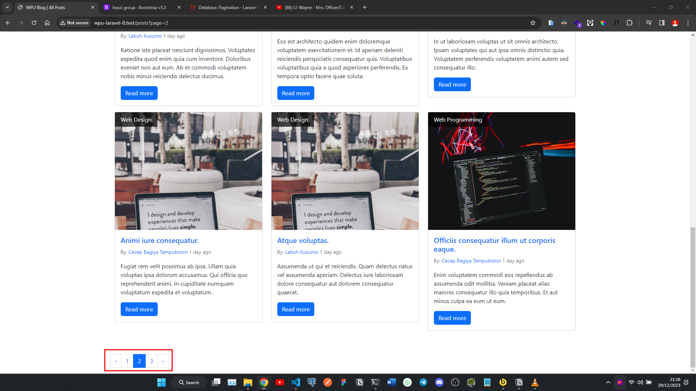

Jika kalian ingin membuat posisi nya berada disebelah kanan, kita bisa akalin dengan div yang memiliki style flexbox dan content nya berada di akhir atau kanan

```php
<div class="d-flex justify-content-end">
    {{ $posts->links() }}
</div>
```

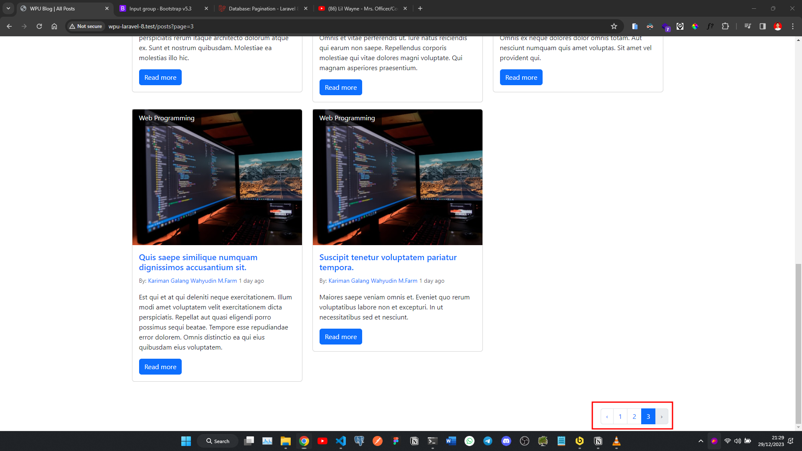

Namun sekarang terdapat problem sedikit yaitu ketika kita pindah dari page 1 ke page lainnya pada spesifik category atau author, maka akan ter-reset kembali feature filter nya

misalkan route nya `/posts?category=web-programming` nah jika kita pindah ke page 2 menggunakan pagination maka seharusnya route nya seperti ini `/posts?category=web-programming&page=2`. Namun yang terjadi filter category nya hilang menjadi `/posts?page=2` saja

Bagaimana cara mengatasi nya? caranya cukup mudah, yaitu kita tinggal tambahkan method `withQueryString` di file `PostController.php` nya

```php
public function index()
{
    ...

    return view('posts', [
        "title" => "All Posts" . $title,
        "active" => "posts",
        "posts" => Post::latest()->filter(request(['search', 'category', 'author']))->paginate(7)->withQueryString()
    ]);
}
```
