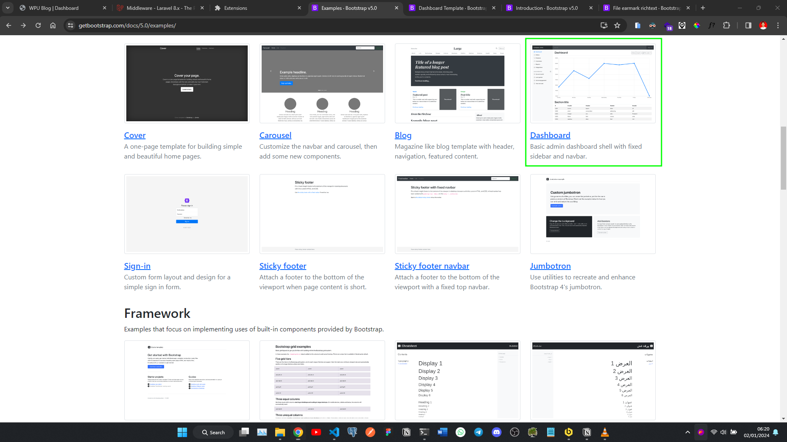
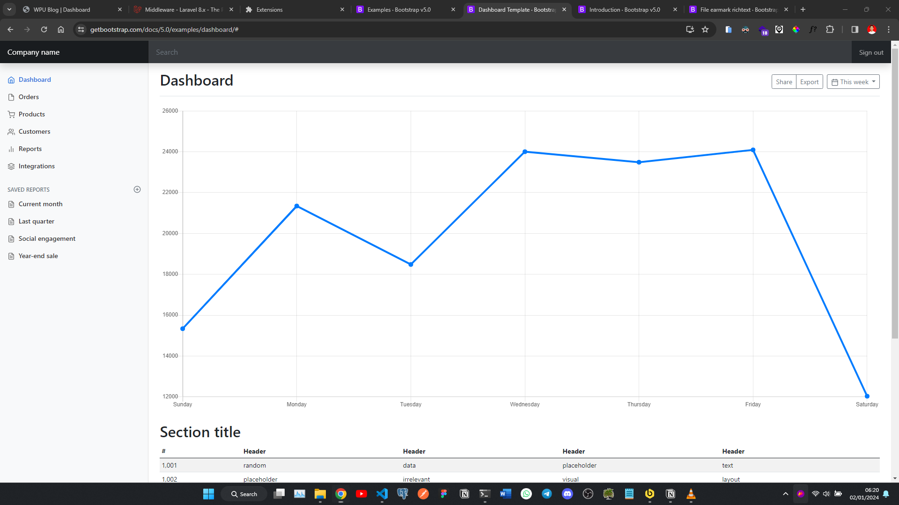
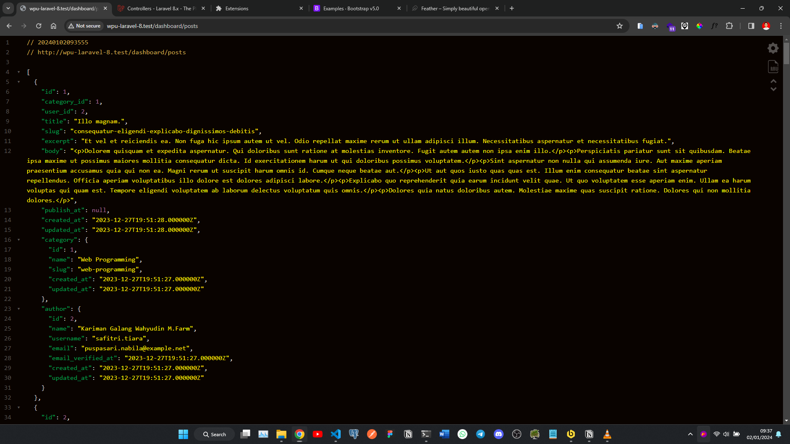
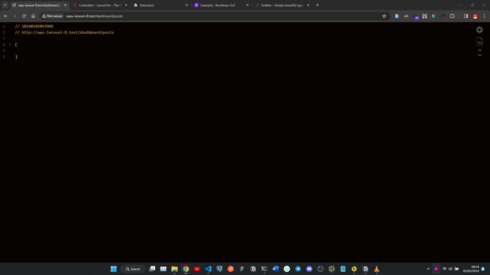
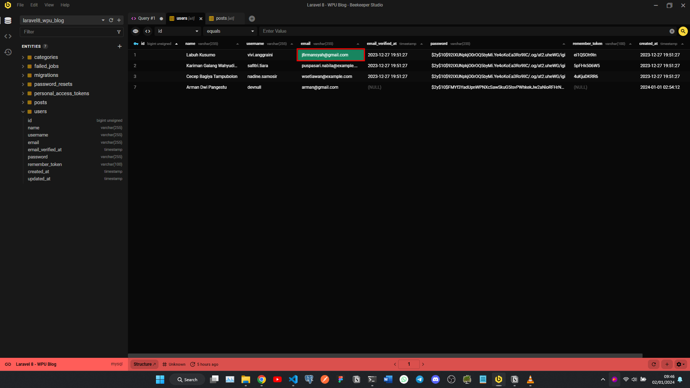
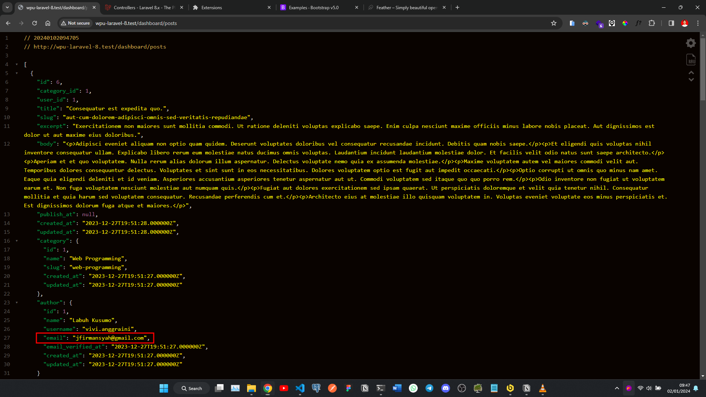
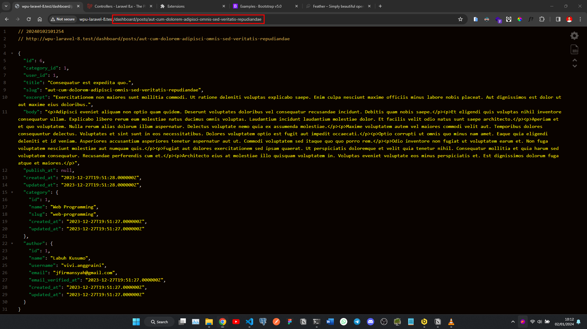
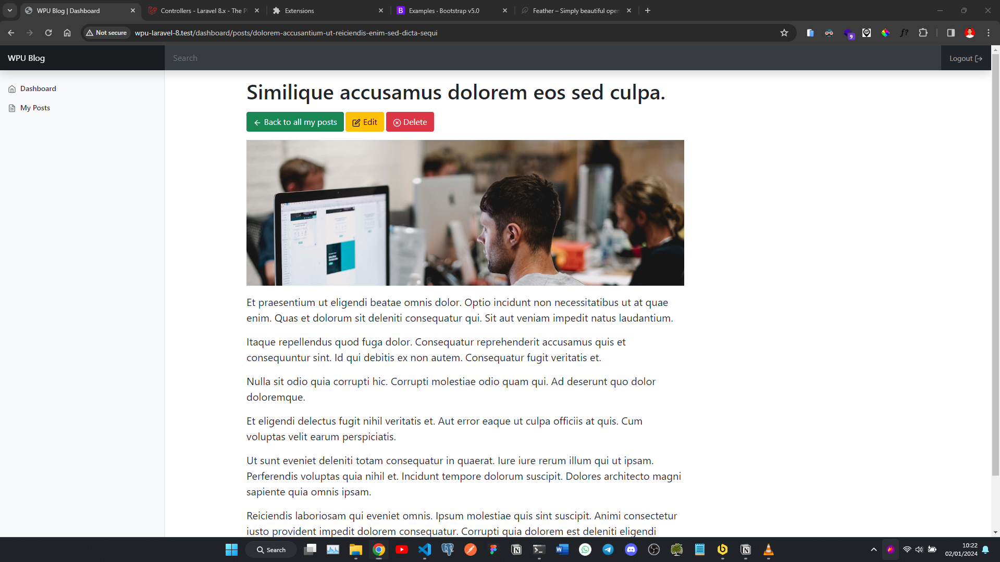

## Daftar Isi

- [Pendahuluan](#pendahuluan)
- [Implementasi Komponen Dashboard](#implementasi-komponen-dashboard)
  - [Partial Layout](#partial-layout)
    - [Main Layout](#main-layout)
    - [Header Layout](#header-layout)
    - [Sidebar Layout](#sidebar-layout)
    - [Content Dashboard](#content-dashboard)
- [Dashboard Posts](#dashboard-posts)
  - [Resource Controller](#resource-controller)
  - [Membuat DashboardPostController](#membuat-dashboardpostcontroller)
  - [Membuat Route Resource](#membuat-route-resource)
  - [Membuat View Dashboard Posts](#membuat-view-dashboard-posts)
    - [Detail Post](#detail-post)

## Pendahuluan

Setelah sebelumya kita sudah berhasil menambahkan feature login dan registrasi pada aplikasi blog sistem kita. Kali ini kita akan masuk kedalam dashboard dalam aplikasi kita, dimana nantinya kita bisa menambahkan feature pengelolaan postingan kita atau blog post kita seperti menambah, melihat detail, mengubah dan menghapus atau istilah nya disebut dengan CRUD (Create, Read, Update dan Delete) Operation.

Nah, sebelum masuk kesana kita akan membuat terlebih dahulu tampilan atau UI dari halaman dashboard nya itu sendiri, nantinya kita akan memanfaatkan kembali template atau komponen example yang sudah dikasih oleh bootstrap secara gratis untuk kita implementasikan sebagai dashboard kita.

Kita bisa ambil template atau komponen yang namanya `Dashboard` pada bagian example bootstrap





Nantinya dashboard ini akan kita gunakan untuk mengelola data post dari tiap-tiap user nya, misalkan jika user ingin menambahkan, mengubah atau menghapus postingan maka akan melalui dashboard ini.

## Implementasi Komponen Dashboard

Jika kalian sebelumnya sudah mendownload file zip example nya, maka terdapat folder `dashboard` yang isinya terdapat beberapa file diantaranya adalah

- `dashboard.css`
- `dashboard.js`
- `dashboard.rtl.css`
- `index.html`

Bisa kalian copy file `dashboard.css` ke lokasi `public/assets/css` dan file `dashboard.js` ke lokasi `public/assets/js`.

Sekarang kalian bisa ubah file view untuk dashboard nya di `resources/views/dashboard/index.blade.php` dengan isian dari file komponen dashboard `index.html` seperti berikut ini

```php
<!doctype html>
<html lang="en">
<head>
    <meta charset="utf-8">
    <meta name="viewport" content="width=device-width, initial-scale=1">
    <title>WPU Blog | Dashboard</title>

    <!-- Bootstrap core CSS -->
    <link href="https://cdn.jsdelivr.net/npm/bootstrap@5.0.2/dist/css/bootstrap.min.css" rel="stylesheet" integrity="sha384-EVSTQN3/azprG1Anm3QDgpJLIm9Nao0Yz1ztcQTwFspd3yD65VohhpuuCOmLASjC" crossorigin="anonymous">
    <!-- Custom styles for this template -->
    <link href="/assets/css/dashboard.css" rel="stylesheet">
</head>
<body>

    <header class="navbar navbar-dark sticky-top bg-dark flex-md-nowrap p-0 shadow">
        <a class="navbar-brand col-md-3 col-lg-2 me-0 px-3" href="#">WPU Blog</a>
        <button class="navbar-toggler position-absolute d-md-none collapsed" type="button" data-bs-toggle="collapse" data-bs-target="#sidebarMenu" aria-controls="sidebarMenu" aria-expanded="false" aria-label="Toggle navigation">
            <span class="navbar-toggler-icon"></span>
        </button>
        <input class="form-control form-control-dark w-100" type="text" placeholder="Search" aria-label="Search">
        <div class="navbar-nav">
            <div class="nav-item text-nowrap">
                <form action="/logout" method="POST">
                    @csrf
                    <button type="submit" class="nav-link px-3 bg-dark border-0">
                        Logout <span data-feather="log-out"></span>
                    </button>
                </form>
            </div>
        </div>
    </header>

    <div class="container-fluid">
        <div class="row">
            <nav id="sidebarMenu" class="col-md-3 col-lg-2 d-md-block bg-light sidebar collapse">
                <div class="position-sticky pt-3">
                    <ul class="nav flex-column">
                        <li class="nav-item">
                            <a class="nav-link active" aria-current="page" href="#">
                                <span data-feather="home"></span>
                                Dashboard
                            </a>
                        </li>
                        <li class="nav-item">
                            <a class="nav-link" href="#">
                                <span data-feather="file-text"></span>
                                My Posts
                            </a>
                        </li>
                    </ul>
                </div>
            </nav>

            <main class="col-md-9 ms-sm-auto col-lg-10 px-md-4">
                <div class="d-flex justify-content-between flex-wrap flex-md-nowrap align-items-center pt-3 pb-2 mb-3 border-bottom">
                    <h1 class="h2">Welcome back, {{ auth()->user()->name }}</h1>
                </div>
            </main>
        </div>
    </div>


    <script src="https://cdn.jsdelivr.net/npm/bootstrap@5.0.2/dist/js/bootstrap.bundle.min.js" integrity="sha384-MrcW6ZMFYlzcLA8Nl+NtUVF0sA7MsXsP1UyJoMp4YLEuNSfAP+JcXn/tWtIaxVXM" crossorigin="anonymous"></script>

    <script src="https://cdn.jsdelivr.net/npm/feather-icons@4.28.0/dist/feather.min.js" integrity="sha384-uO3SXW5IuS1ZpFPKugNNWqTZRRglnUJK6UAZ/gxOX80nxEkN9NcGZTftn6RzhGWE" crossorigin="anonymous"></script>

    <script src="/assets/js/dashboard.js"></script>
</body>
</html>
```

Maka sekarang tampilan dashboard nya akan terlihat seperti gambar berikut ini


### Partial Layout

Setelah kita berhasil mengimplementasikan komponen dashboard dari example bootstrap kedalam aplikasi kita, selanjutnya kita buat agar komponen tersebut menjadi partial layout atau kita pecah.

#### Main Layout

Untuk melakukan partial dashboard nya, kita buat file baru untuk membuat main layout nya di `resources/views/dashboard/layouts/main.blade.php` dengan isian seperti ini

```php
<!doctype html>
<html lang="en">
<head>
    <meta charset="utf-8">
    <meta name="viewport" content="width=device-width, initial-scale=1">
    <title>WPU Blog | Dashboard</title>

    <!-- Bootstrap core CSS -->
    <link href="https://cdn.jsdelivr.net/npm/bootstrap@5.0.2/dist/css/bootstrap.min.css" rel="stylesheet" integrity="sha384-EVSTQN3/azprG1Anm3QDgpJLIm9Nao0Yz1ztcQTwFspd3yD65VohhpuuCOmLASjC" crossorigin="anonymous">
    <!-- Custom styles for this template -->
    <link href="/assets/css/dashboard.css" rel="stylesheet">
</head>
<body>

    @include('dashboard.layouts.header')

    <div class="container-fluid">
        <div class="row">

            @include('dashboard.layouts.sidebar')

            <main class="col-md-9 ms-sm-auto col-lg-10 px-md-4">
                @yield('container')
            </main>
        </div>
    </div>


    <script src="https://cdn.jsdelivr.net/npm/bootstrap@5.0.2/dist/js/bootstrap.bundle.min.js" integrity="sha384-MrcW6ZMFYlzcLA8Nl+NtUVF0sA7MsXsP1UyJoMp4YLEuNSfAP+JcXn/tWtIaxVXM" crossorigin="anonymous"></script>

    <script src="https://cdn.jsdelivr.net/npm/feather-icons@4.28.0/dist/feather.min.js" integrity="sha384-uO3SXW5IuS1ZpFPKugNNWqTZRRglnUJK6UAZ/gxOX80nxEkN9NcGZTftn6RzhGWE" crossorigin="anonymous"></script>

    <script src="/assets/js/dashboard.js"></script>
</body>
</html>
```

### Header Layout

Setelah main layout dibuat, sekarang kita buat untuk layout header di lokasi `resources/views/dashboard/layouts/header.blade.php` dengan isian seperti ini

```php
<header class="navbar navbar-dark sticky-top bg-dark flex-md-nowrap p-0 shadow">
    <a class="navbar-brand col-md-3 col-lg-2 me-0 px-3" href="#">WPU Blog</a>
    <button class="navbar-toggler position-absolute d-md-none collapsed" type="button" data-bs-toggle="collapse" data-bs-target="#sidebarMenu" aria-controls="sidebarMenu" aria-expanded="false" aria-label="Toggle navigation">
        <span class="navbar-toggler-icon"></span>
    </button>
    <input class="form-control form-control-dark w-100" type="text" placeholder="Search" aria-label="Search">
    <div class="navbar-nav">
        <div class="nav-item text-nowrap">
            <form action="/logout" method="POST">
                @csrf
                <button type="submit" class="nav-link px-3 bg-dark border-0">
                    Logout <span data-feather="log-out"></span>
                </button>
            </form>
        </div>
    </div>
</header>
```

### Sidebar Layout

Sekarang terakhir kita buat layout untuk bagian sidebar nya di lokasi `resources/views/dashboard/layouts/sidebar.blade.php` dengan isian seperti ini

```php
<nav id="sidebarMenu" class="col-md-3 col-lg-2 d-md-block bg-light sidebar collapse">
    <div class="position-sticky pt-3">
        <ul class="nav flex-column">
            <li class="nav-item">
                <a class="nav-link active" aria-current="page" href="#">
                    <span data-feather="home"></span>
                    Dashboard
                </a>
            </li>
            <li class="nav-item">
                <a class="nav-link" href="#">
                    <span data-feather="file-text"></span>
                    My Posts
                </a>
            </li>
        </ul>
    </div>
</nav>
```

### Content Dashboard

Maka sekarang file `resources/views/dashboard/index.blade.php` nya kita cukup gunakan masing-masing partial tersebut seperti ini

```php
@extends('dashboard.layouts.main')

@section('container')
    <div class="d-flex justify-content-between flex-wrap flex-md-nowrap align-items-center pt-3 pb-2 mb-3 border-bottom">
        <h1 class="h2">Welcome back, {{ auth()->user()->name }}</h1>
    </div>
@endsection
```

## Dashboard Posts

Selanjutnya kita akan membuat route untuk menangani halaman posts yang ada di dashboard, untuk melakukannya kita ubah dulu href pada sibedar nya agar mengarah ke `/dashboard/posts`

```html
<li class="nav-item">
  <a class="nav-link" href="/dashboard/posts">
    <span data-feather="file-text"></span>
    My Posts
  </a>
</li>
```

Nantinya route tersebut akan mengarah kesebuah controller baru, controller ini akan kita pakai untuk mengelola semua data post oleh user tertentu, sehingga user bisa menambahkan, mengedit, melihat detail dan menghapus postingan atau CRUD.

### Resource Controller

Nah untuk melakukan hal tersebut, nantinya kita akan membuat sebuah routes yang mengarah ke controller yang kita sebut dengan Resource Controller. Apa itu Resource Controller? yaitu sebuah controller yang sudah otomatis mengelola data CRUD, sehingga kita tidak perlu lagi secara manual untuk mencari tau route nya apa.

Jika dikutip dari dokumentasi resmi Laravel nya, jika kita menggangap sebuah model di Eloquent kita sebagai resource, itu merupakan sebuah kumpulan aksi yang biasanya kita bikin untuk melakukan sesuatu terhadap resource kita. Contohnya, bayangkan saja aplikasi kita mempunyai model `Photo` dan model `Movie`. Nah, biasanya kan kita akan create, read, update atau delete pada resource tersebut.

Karena hal tersebut sudah umum dilakukan dalam use case, Laravel ini sudah membuatkan sebuah route khusus untuk melakukan CRUD tersebut yang dinamakan dengan resource controller. Cara membuatnya ketika kita mengetikan perintah `make:controller` di perintah artisan, kita bisa tambahkan parameter atau option `--resource` sehingga nantinya akan otomatis dibuatkan controller yang sudah mempunyai route ke list berikut ini

| Verb      | URI                    | Action  | Route Name     |
| --------- | ---------------------- | ------- | -------------- |
| GET       | `/photos`              | index   | photos.index   |
| GET       | `/photos/create`       | create  | photos.create  |
| POST      | `/photos`              | store   | photos.store   |
| GET       | `/photos/{photo}`      | show    | photos.show    |
| GET       | `/photos/{photo}/edit` | edit    | photos.edit    |
| PUT/PATCH | `/photos/{photo}`      | update  | photos.update  |
| DELETE    | `/photos/{photo}`      | destroy | photos.destroy |

Nah, nantinya didalam routes `web.php` nya kita tidak perlu lagi bikin satu-persatu untuk setiap route tersebut, cukup satu baris route berikut ini akan menangani semua nya

```php
use App\Http\Controllers\PhotoController;

Route::resource('photos', PhotoController::class);
```

### Membuat DashboardPostController

Sekarang kita bisa buat controller baru dengan nama `DashboardPostController` sekaligus memiliki route model binding ke model `Post` menggunakan perintah php artisan berikut ini

```php
php artisan make:controller DashboardPostController --resource --model=Post
```

Nah maka sekarang akan terbuat controller baru yang isinya sudah terhubung ke model Post dan memiliki banyak method didalamnya

```php
use App\Models\Post;

class DashboardPostController extends Controller
{
    public function index()
    {
        //
    }

    public function create()
    {
        //
    }

    public function store(Request $request)
    {
        //
    }

    ...
}
```

### Membuat Route Resource

Sekarang kita buat route baru di `web.php` yang nama request nya `resource`

```php
use App\Http\Controllers\DashboardPostController;

Route::resource('/dashboard/posts', DashboardPostController::class)->middleware('auth');
```

Sekarang kita cek apakah route tersebut sudah memanggil controller tersebut atau bukan, kita bisa tambahkan kode berikut ini didalam method `index` pada `DashboardPostController`

```php
public function index()
{
    return 'ini halaman dashboard post';
}
```

Maka jika kalian pergi ke navlink `My Posts` akan muncul output seperti gambar berikut ini


Sekarang bisa kita ganti agar yang di return nya adalah sebuah view

```php
public function index()
{
    return view('dashboard.posts.index');
}
```

### Membuat View Dashboard Posts

Selanjutnya kita buat view baru di `/resources/views/dashboard/posts/index.blade.php`

```php
@extends('dashboard.layouts.main')

@section('container')
    <div class="d-flex justify-content-between flex-wrap flex-md-nowrap align-items-center pt-3 pb-2 mb-3 border-bottom">
        <h1 class="h2">My Posts</h1>
    </div>
@endsection
```

Maka sekarang jika kalian refresh, tampilan nya akan seperti gambar berikut ini


Nah, namun jika kalian sadar sekarang navlink active nya tidak berpindah, kita bisa perbaiki di file `sidebar.blade.php` agar navlink active nya dinamis terhadap request route nya

```php
<ul class="nav flex-column">
    <li class="nav-item">
        <a class="nav-link {{ Request::is('dashboard') ? 'active' : '' }}" aria-current="page" href="/dashboard">
            <span data-feather="home"></span>
            Dashboard
        </a>
    </li>
    <li class="nav-item">
        <a class="nav-link {{ Request::is('dashboard/posts') ? 'active' : '' }}" href="/dashboard/posts">
            <span data-feather="file-text"></span>
            My Posts
        </a>
    </li>
</ul>
```

Maka sekarang class `active` pada bagian navlink nya akan otomatis sesuai dengan request route nya


Selanjutnya kita isikan konten post nya menggunakan table yang isinya sesuai dengan postingan user nya

```php
@extends('dashboard.layouts.main')

@section('container')
    <div class="d-flex justify-content-between flex-wrap flex-md-nowrap align-items-center pt-3 pb-2 mb-3 border-bottom">
        <h1 class="h2">My Posts</h1>
    </div>

    <div class="table-responsive">
        <table class="table table-striped table-sm">
            <thead>
            <tr>
                <th scope="col">#</th>
                <th scope="col">Title</th>
                <th scope="col">Category</th>
                <th scope="col">Action</th>
            </tr>
            </thead>
            <tbody>
            <tr>
                <td>1,001</td>
                <td>random</td>
                <td>data</td>
                <td>placeholder</td>
                <td>text</td>
            </tr>
            </tbody>
        </table>
    </div>
@endsection
```

Selanjutnya kita kirimkan data post nya di controller nya, namun bukan semua post, misalkan kita return seperti ini

```php
public function index()
{
    return Post::all();
    return view('dashboard.posts.index', [
        'posts' => Post::all()
    ]);
}
```

Nah `Post::all()` tersebut akan mengembalikan semua data post yang ada didalam database, sedangkan kita tidak ingin karena yang kita inginkan itu adalah postingan sesuai dengan user yang login



Bagaimana caranya? caranya kita ganti query nya bukan menggunakan `all` tetapi menggunakan `where` dengan user id yang login seperti ini

```php
return Post::where('user_id', auth()->user()->id)->get();
```

Jika kalian sekarang refresh, maka akan muncul array kosong atau data postingan nya kosong, itu terjadi karena user yang kita buat sebelumnya pada proses registrasi memang tidak memiliki postingan



Alternative nya kita bisa logout dan login kembali menggunakan user lain, misalkan disini saya ada user lain yang email `jfirmansyah@example.com` dan password nya `password`


> **Catatan**:
>
> Jika kalian tidak bisa login menggunakan user yang domain email nya `example.com`, kalian bisa ganti record data nya ke domain yang valid misalkan `gmail.com`. Hal tersebut terjadi karena validasi di `email:dns` pada Laravel sangat strict atau sangat ketat yang dimana bahkan regex nya bisa mendeteksi hingga level domain bukan hanya sekedar format penulisan email saja.
>
> 
>
> 

Maka sekarang jika kalian mencoba melihat ke navlink `My Posts` akan muncul data postingan yang me-relasi ke user yang login



Sehingga sekarang kita bisa kirimkan data `posts` tersebut kedalam view untuk dilakukan looping

```php
public function index()
{
    return view('dashboard.posts.index', [
        'posts' => Post::where('user_id', auth()->user()->id)->get()
    ]);
}
```

```php
@extends('dashboard.layouts.main')

@section('container')
    <div class="d-flex justify-content-between flex-wrap flex-md-nowrap align-items-center pt-3 pb-2 mb-3 border-bottom">
        <h1 class="h2">My Posts</h1>
    </div>

    <div class="table-responsive col-lg-8">
        <table class="table table-striped table-sm">
            <thead>
                <tr>
                    <th scope="col">#</th>
                    <th scope="col">Title</th>
                    <th scope="col">Category</th>
                    <th scope="col">Action</th>
                </tr>
            </thead>
            <tbody>
                @foreach ($posts as $post)
                    <tr>
                        <td>{{ $loop->iteration }}</td>
                        <td>{{ $post->title }}</td>
                        <td>{{ $post->category->name }}</td>
                        <td>
                            <a href="/dashboard/posts/{{ $post->id }}" class="badge bg-info">
                                <span data-feather="eye"></span>
                            </a>
                            <a href="/dashboard/posts/{{ $post->id }}" class="badge bg-warning">
                                <span data-feather="edit"></span>
                            </a>
                            <a href="/dashboard/posts/{{ $post->id }}" class="badge bg-danger">
                                <span data-feather="x-circle"></span>
                            </a>
                        </td>
                    </tr>
                @endforeach
            </tbody>
        </table>
    </div>
@endsection
```

Maka tampilan nya akan terlihat seperti gambar dibawah ini


#### Detail Post

Setelah halaman `My Posts` dibuat, sekarang kita lanjut buat halaman untuk menangani single post atau detail post nya ketika di klik. Untuk membuatnya kita tidak perlu menangani didalam routes nya karena kita menggunakan Resource Controller, sehingga kita cukup tangani di method `show`

```php
public function show(Post $post)
{
    return $post;
}
```

Jika sekarang kalian mengunjungi detail post nya pada action icon eye, maka akan muncul detail data postingan nya, namun disini di query nya menggunakan `id` bukan `slug`


Bagaimana agar query nya menggunakan `slug`? Jika menggunakan resource, sayangnya kita tidak bisa menggunakan route model binding seperti `{post:slug}` berikut ini

```php
Route::resource('/dashboard/posts/{post:slug}', DashboardPostController::class)->middleware('auth');
```

Maka tidak akan jalan, karena URL nya bukan seperti itu. Sebetulnya kita bisa bikin route baru untuk me-override atau menimpa seperti ini

```php
Route::get('/dashboard/posts/{post:slug}')
```

Namun sayang banget jika kita sudah menggunakan resource tapi kita membuat route nya lagi. Untuk mengakali hal tersebut yaitu dengan membuat `slug` menjadi nilai default untuk pencarian, sehingga meskipun kita tidak menggunakan route model binding, nilai default yang dicari itu akan otomatis `slug` bukan lagi `id`. Caranya kita timpa menggunakan sebuah method `getRouteKeyName` didalam model Eloquent kita `Post.php`

```php
public function getRouteKeyName()
{
    return 'slug';
}
```

Sekarang kita cukup ubah href pada bagian dashboard my posts nya agar mengirimkan `slug` bukan `id` lagi

```php
<a href="/dashboard/posts/{{ $post->slug }}" class="badge bg-info">
    <span data-feather="eye"></span>
</a>
```



Nah, namun yang kita inginkan bukan menampilkan data seperti itu melainkan sebuah view

```php
public function show(Post $post)
{
    return view('dashboard.posts.show', [
        "post" => $post
    ]);
}
```

Selanjutnya kita buat view nya di `resources/views/dashboard/posts/show.blade.php`

```php
@extends('dashboard.layouts.main')

@section('container')
    <div class="container">
        <div class="row mb-5">
            <div class="col-lg-8">
                <h1 class="my-3">{{ $post->title }}</h1>

                <a href="/dashboard/posts" class="btn btn-success"><span data-feather="arrow-left"></span> Back to all my posts</a>
                <a href="" class="btn btn-warning"><span data-feather="edit"></span> Edit</a>
                <a href="" class="btn btn-danger"><span data-feather="x-circle"></span> Delete</a>

                category->name }}" alt="{{ $post->category->name }}" class="img-fluid mt-3">

                <article class="my-3 fs-5">
                    {!! $post->body !!}
                </article>

                <a href="/posts" class="d-block mt-3">Back to Posts</a>
            </div>
        </div>
    </div>
@endsection
```

Maka tampilannya akan seperti gambar dibawah ini


