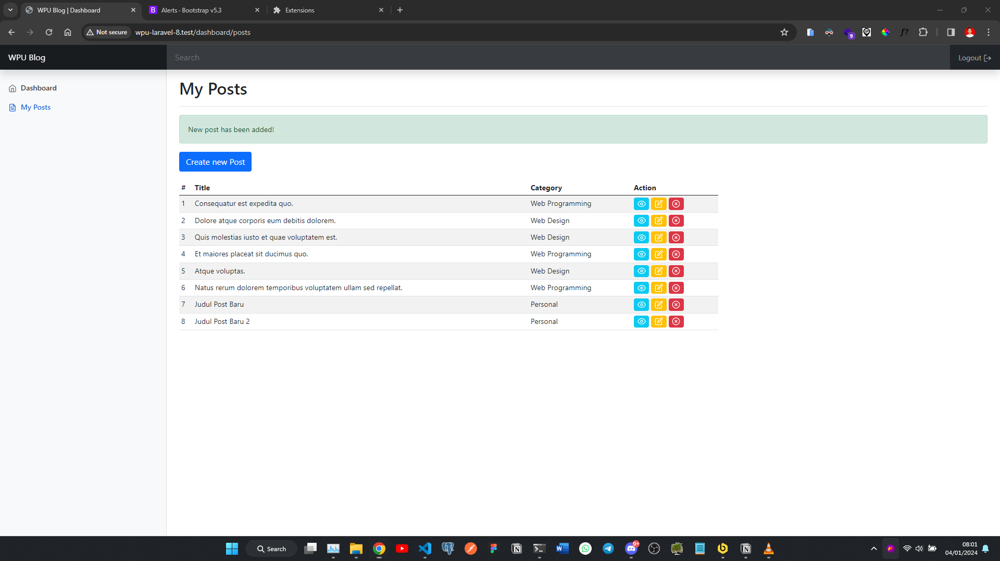

## Daftar Isi

- [Pendahuluan](#pendahuluan)
- [Validasi Post](#validasi-post)
- [Insert Post](#insert-post)

## Pendahuluan

Setelah sebelumnya kita berhasil membuat sebuah form untuk create blog post kita, pada pembahasan kali ini kita akan mencoba untuk melengkapi nya dengan feature validasi pada form nya dan insert kedalam databasenya.

## Validasi Post

Untuk melakukan validasi nya kita bisa tambahkan pengecekan di method `store` pada `DashboardPostController.php` nya seperti berikut ini

```php
class DashboardPostController extends Controller
{
    ...

    public function store(Request $request)
    {
        $validateData = $request->validate([
            'title' => 'required|max:255',
            'slug' => 'required|unique:posts',
            'category_id' => 'required',
            'body' => 'required'
        ]);
    }

    ...
}
```

Selanjutnya kita berikan pesan error di bagian view `create.blade.php`

```php
<form action="/dashboard/posts" method="POST" class="mb-5">
    @csrf
    <div class="mb-3">
        <label for="title" class="form-label">Title</label>
        <input type="text" class="form-control @error('title')
            is-invalid
        @enderror" id="title" name="title" required autofocus value="{{ old('title') }}">
        @error('title')
            <div class="invalid-feedback">
                {{ $message }}
            </div>
        @enderror
    </div>
    <div class="mb-3">
        <label for="slug" class="form-label">Slug</label>
        <input type="text" class="form-control @error('slug')
            is-invalid
        @enderror" id="slug" name="slug" required value="{{ old('slug') }}">
        @error('slug')
            <div class="invalid-feedback">
                {{ $message }}
            </div>
        @enderror
    </div>
    <div class="mb-3">
        <label for="category" class="form-label">Category</label>
        <select class="form-select" name="category_id" id="category">
            @foreach ($categories as $category)
                {{-- Using double equal because the data type between method old and from database is different --}}
                {{-- method old = string, data from db = integer --}}
                @if (old('category_id') == $category->id)
                    <option value="{{ $category->id }}" selected>{{ $category->name }}</option>
                @else
                    <option value="{{ $category->id }}">{{ $category->name }}</option>
                @endif
            @endforeach
        </select>
    </div>
    <div class="mb-3">
        <label for="body" class="form-label">Body</label>
        @error('body')
            <p class="text-danger">{{ $message }}</p>
        @enderror
        <input id="body" type="hidden" name="body" value="{{ old('body') }}">
        <trix-editor input="body"></trix-editor>
    </div>
    <button type="submit" class="btn btn-primary">Create Post</button>
</form>
```

## Insert Post

Setelah membuatkan validasi dan pesan error dari sisi controller dan view, sekarang kita tambahkan data tambahan seperti `user_id` dan `body` kemudian kita insert data post nya dan redirect dengan membawa pesan flash message di file `/dashboard/posts/index.blade.php`

```php
class DashboardPostController extends Controller
{
    ...

    public function store(Request $request)
    {
        $validateData = $request->validate([
            'title' => 'required|max:255',
            'slug' => 'required|unique:posts',
            'category_id' => 'required',
            'body' => 'required'
        ]);

        $validateData['user_id'] = auth()->user()->id;
        $validateData['excerpt'] = Str::limit(strip_tags($request->body), 200);

        Post::create($validateData);

        return redirect('/dashboard/posts')->with('succes', 'New post has been added!');
    }

    ...
}
```

```php
@extends('dashboard.layouts.main')

@section('container')
    <div class="d-flex justify-content-between flex-wrap flex-md-nowrap align-items-center pt-3 pb-2 mb-3 border-bottom">
        <h1 class="h2">My Posts</h1>
    </div>

    @if (session()->has('success'))
        <div class="alert alert-success" role="alert">
            {{ session('success') }}
        </div>
    @endif

    <div class="table-responsive col-lg-8">
        <a href="/dashboard/posts/create" class="btn btn-primary mb-3">Create new Post</a>
        <table class="table table-striped table-sm">
            ...
        </table>
    </div>
@endsection
```

Maka sekarang jika kalian mencoba menambahkan postingan baru, datanya akan masuk kedalam database dengan flash message yang sudah dibuat di controller nya



