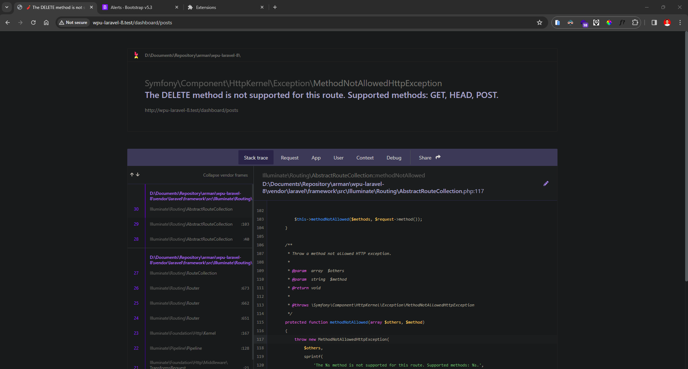
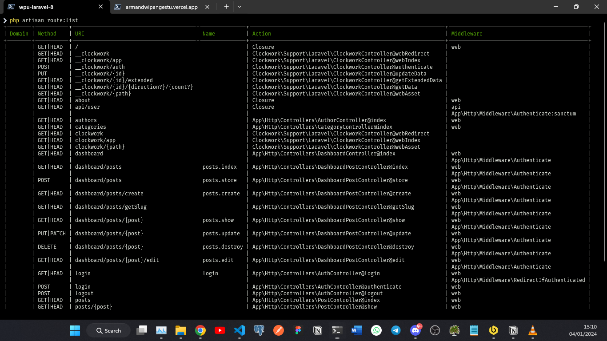

## Daftar Isi

- [Pendahuluan](#pendahuluan)
- [Delete Post](#delete-post)
  - [Handle Route Delete](#handle-route-delete)
- [Edit Post](#edit-post)
  - [Handle Route Edit](#handle-route-edit)
  - [Problem Unique Slug Pada Update Post](#problem-unique-slug-pada-update-post)

## Pendahuluan

Pada pembahasan kali ini kita akan melengkapi aplikasi blog sederhana kita, setelah sebelumnya kita berhasil menambahkan feature CREATE dan READ data, kali ini kita akan melengkapi lagi dengan menambahkan feature UPDATE dan DELETE, sehingga feature CRUD nya sudah bisa dijalankan semua.

## Delete Post

Untuk melakukan delete sebetulnya simpel, kita cukup jadikan button nya menjadi sebuah form yang mengirim method `DELETE` ke route resource controller kita di `/dashboard/posts` agar nantinya ditangani oleh method `destroy`. Untuk melakukannya kalian bisa buka file view `dashboard/posts/index.blade.php`

> **Catatan**:
>
> Method `POST` pada bagian form disini hanya sebagai nilai saja, karena value dari attribute method pada element form disini hanya bisa dua, yaitu `GET` dan `POST`. Sehingga kita perlu "membajak" nya agar menggunakan method `DELETE`

```php
@extends('dashboard.layouts.main')

@section('container')
    ...

    <div class="table-responsive col-lg-8">
        ...
        <table class="table table-striped table-sm">
            <thead>
                <tr>
                    <th scope="col">#</th>
                    <th scope="col">Title</th>
                    <th scope="col">Category</th>
                    <th scope="col">Action</th>
                </tr>
            </thead>
            <tbody>
                @foreach ($posts as $post)
                    <tr>
                        <td>{{ $loop->iteration }}</td>
                        <td>{{ $post->title }}</td>
                        <td>{{ $post->category->name }}</td>
                        <td>
                            ...
                            <form action="/dashboard/posts/{{ $post->slug }}" method="POST" class="d-inline">
                                @method("DELETE")
                                @csrf
                                <button class="badge bg-danger border-0" onclick="return confirm('Are you sure?')">
                                    <span data-feather="x-circle"></span>
                                </button>
                            </form>
                        </td>
                    </tr>
                @endforeach
            </tbody>
        </table>
    </div>
@endsection
```

Sekarang jika kalian mencoba click button delete nya, maka akan error karena belum kita tangani route nya



### Handle Route Delete

Untuk menangani request form delete tersebut, kita bisa buka file controller `DashboardPostController.php` kemudian isikan method dari `destroy` nya seperti ini

```php

class DashboardPostController extends Controller
{
    ...

    public function destroy(Post $post)
    {
        Post::destroy($post->id);

        return redirect('/dashboard/posts')->with('success', 'Post has been deleted!');
    }

    ...

}
```

Maka sekarang jika kalian mencoba menghapus postingan akan muncul sebuah alert seperti gambar berikut ini


Jangan lupa juga untuk benarkan tombol delete yang di view `show.blade.php` nya juga agar mengarah ke route resource controller dengan method `DELETE`

```php
@extends('dashboard.layouts.main')

@section('container')
    <div class="container">
        <div class="row mb-5">
            <div class="col-lg-8">
                <h1 class="my-3">{{ $post->title }}</h1>

                <a href="/dashboard/posts" class="btn btn-success"><span data-feather="arrow-left"></span> Back to all my posts</a>
                <a href="" class="btn btn-warning"><span data-feather="edit"></span> Edit</a>
                <form action="/dashboard/posts/{{ $post->slug }}" method="POST" class="d-inline">
                    @method("DELETE")
                    @csrf
                    <button class="btn btn-danger" onclick="return confirm('Are you sure?')">
                        <span data-feather="x-circle"></span> Delete
                    </button>
                </form>

                category->name }}" alt="{{ $post->category->name }}" class="img-fluid mt-3">

                <article class="my-3 fs-5">
                    {!! $post->body !!}
                </article>
            </div>
        </div>
    </div>
@endsection
```

## Edit Post

Nah feature ini sebetulnya mirip banget dengan feature CREATE, bedanya sudah ada isian atau value dari form input nya sesuai dengan data apa yang akan kita edit. Sehingga kita bisa ngambil view nya dari halaman `create.blade.php`, tapi sebelum itu kita perlu arahkan terlebih dahulu agar anchor action nya mengarah ke route `edit` di resource controller kita di file view `index.blade.php`

> **Catatan**: Tips
>
> Jika kalian ingin melihat list route resource kita itu ada apa saja, kalian bisa lihat melalui terminal dengan perintah artisan
>
> ```php
> php artisan route:list
> ```
>
> 

```php
<a href="/dashboard/posts/{{ $post->slug }}/edit" class="badge bg-warning">
    <span data-feather="edit"></span>
</a>
```

### Handle Route Edit

Selanjutnya kita cukup duplicate atau copy paste isian dari file `create.blade.php` kedalam file `edit.blade.php`, setelah itu kita benarkan di file controller nya agar me-load view `edit.blade.php` tersebut

```php
class DashboardPostController extends Controller
{
    ...

    public function edit(Post $post)
    {
        return view('dashboard.posts.edit', [
            'post' => $post,
            'categories' => Category::all()
        ]);
    }

    ...
}
```

Setelah view nya di load, sekarang kita perbaiki file `edit.blade.php` nya

> **Catatan**:
>
> Method `old` didalam attribute value element input disini sekarang mempunyai parameter ke-2 untuk mengisikan nilai default pada postingan yang mau diedit, sehingga jika nantinya terdapat error pada validasi, yang akan digunakan adalah value old nya

```php
<form action="/dashboard/posts/{{ $post->slug }}" method="POST" class="mb-5">
    @method('PUT')
    @csrf
    <div class="mb-3">
        <label for="title" class="form-label">Title</label>
        <input type="text" class="form-control @error('title')
            is-invalid
        @enderror" id="title" name="title" required autofocus value="{{ old('title', $post->title) }}">
        @error('title')
            <div class="invalid-feedback">
                {{ $message }}
            </div>
        @enderror
    </div>
    <div class="mb-3">
        <label for="slug" class="form-label">Slug</label>
        <input type="text" class="form-control @error('slug')
            is-invalid
        @enderror" id="slug" name="slug" required value="{{ old('slug', $post->slug) }}">
        @error('slug')
            <div class="invalid-feedback">
                {{ $message }}
            </div>
        @enderror
    </div>
    <div class="mb-3">
        <label for="category" class="form-label">Category</label>
        <select class="form-select" name="category_id" id="category">
            @foreach ($categories as $category)
                {{-- Using double equal because the data type between method old and from database is different --}}
                {{-- method old = string, data from db = integer --}}
                @if (old('category_id', $post->category_id) == $category->id)
                    <option value="{{ $category->id }}" selected>{{ $category->name }}</option>
                @else
                    <option value="{{ $category->id }}">{{ $category->name }}</option>
                @endif
            @endforeach
        </select>
    </div>
    <div class="mb-3">
        <label for="body" class="form-label">Body</label>
        @error('body')
            <p class="text-danger">{{ $message }}</p>
        @enderror
        <input id="body" type="hidden" name="body" value="{{ old('body', $post->body) }}">
        <trix-editor input="body"></trix-editor>
    </div>
    <button type="submit" class="btn btn-primary">Update Post</button>
</form>
```

Maka sekarang jika kalian mencoba refresh pada halaman edit nya, akan muncul data dibagian form input nya sesuai dengan data postingan yang kalian ingin ubah


### Problem Unique Slug Pada Update Post

Nah, namun sebelum kita jalankan feature update post dan validasinya, ada yang harus kita pikirkan terlebih dahulu. Apa itu? yang harus kita pikirkan adalah field `slug`, field slug ini agak tricky karena field tersebut `uniqe`. Sehingga jika kita hanya ingin mengubah field lain misalkan hanya category nya saja dan sisanya sama saja, nah hal tersebut nantinya jika kita lakukan update maka field `slug` tersebut juga akan di update juga, yang dimana begitu di update tidak akan bisa atau terhalang karena isian slug nya sama (kecuali jika kita ubah menjadi slug yang baru). Hal tersebut nanti kita perlu akalin agar tidak begitu saja diubah.

Sekarang kita coba buat validasi di method `update` pada controller nya

```php
class DashboardPostController extends Controller
{
    ...

    public function update(Request $request, Post $post)
    {
        $validateData = $request->validate([
            'title' => 'required|max:255',
            'slug' => 'required|unique:posts',
            'category_id' => 'required',
            'body' => 'required'
        ]);
    }

    ...
}
```

Pada bagian validasi tersebut, kita melakukan validasi pada field `slug` yang dimana harus di isi `required` dan harus unique `unique:posts`. Nah, problem nya sekarang bagaimana jika slug nya sama (kita tidak mau mengubah), hal tersebut nantinya akan menjadi problem karena slug yang lama sudah ada didalam database. Cara mengatasi nya kita perlu keluarkan validasi slug tersebut diluar property `$validateData` agar bisa kita berikan kondisi

```php
class DashboardPostController extends Controller
{
    ...

    public function update(Request $request, Post $post)
    {
        $rules = [
            'title' => 'required|max:255',
            'category_id' => 'required',
            'body' => 'required'
        ];

        if ($request->slug != $post->slug) {
            $rules['slug'] = 'required|unique:posts';
        }

        $validateData = $request->validate($rules);

        $validateData['user_id'] = auth()->user()->id;
        $validateData['excerpt'] = Str::limit(strip_tags($request->body), 200);

        Post::where('id', $post->id)
            ->update($validateData);

        return redirect('/dashboard/posts')->with('success', 'Post has been updated!');
    }

    ...
}
```

Maka sekarang jika kalian mencoba mengubah data post nya, akan berhasil dan mengirimkan flash message dengan tulisan `Post has been updated!`


Terakhir kita benarkan agar anchor tombol edit yang di view `show.blade.php` nya juga agar mengarah ke route `/dashboard/posts/{post:slug}/edit`

```php
<a href="/dashboard/posts/{{ $post->slug }}/edit" class="btn btn-warning"><span data-feather="edit"></span> Edit</a>
```
