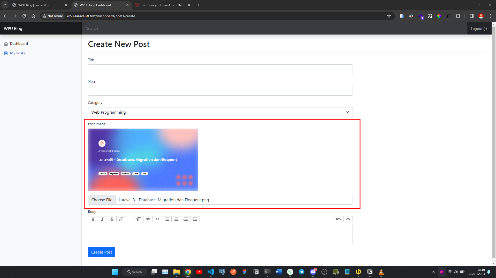
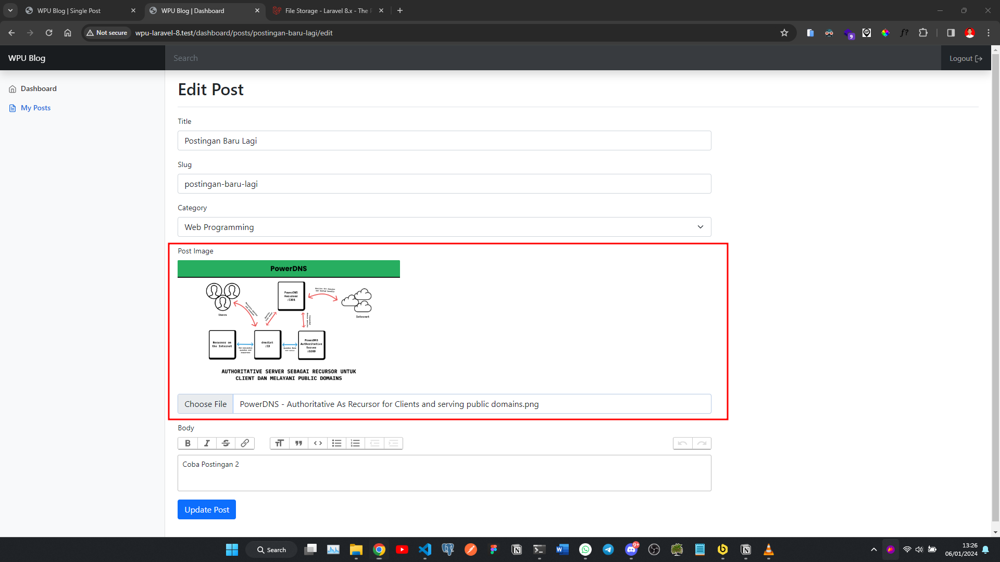
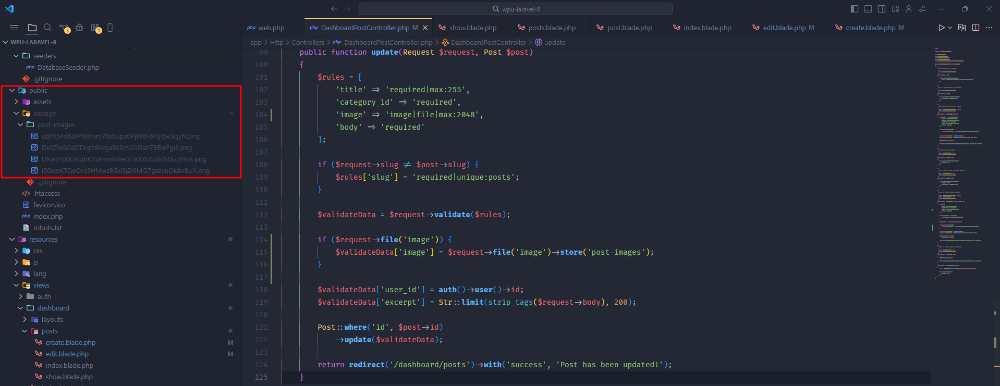

## Daftar Isi

- [Pendahuluan](#pendahuluan)
- [Preview Image](#preview-image)
  - [Update Post](#update-post)
- [Delete Image](#delete-image)

## Pendahuluan

Pada pembahasan kali ini kita akan melanjutkan feature pengelolaan gambar pada blog post kita sebelumnya, kali ini kita akan menerapkan 3 buah feature, yaitu preview, update dan delete image.

## Preview Image

Untuk menambahkan feature preview image ini kita membutuhkan JavaScript dan feature tersebut hanya akan jalan di browser-browser baru, jika di browser-browser lama seperti IE (Internet Explorer) maka feature tersebut tidak akan berjalan. Untuk menambahkan nya kalian bisa buka file view `create.blade.php`, kita tambahkan attribute `onchange` pada input gambar nya kemudian isikan value untuk eksekusi function `previewImage()`, yang dimana nantinya function tersebut akan melakukan DOM pada element `img` dengan class `img-preview` untuk mengatur `src` dari gambar nya

```html
<div class="mb-3">
  <label for="image" class="form-label">Post Image</label>
  
  <input
    class="form-control @error('image')
        is-invalid
    @enderror"
    type="file"
    id="image"
    name="image"
    onchange="previewImage()"
  />
  @error('image')
  <div class="invalid-feedback">{{ $message }}</div>
  @enderror
</div>
```

Selanjutnya kita buat script JavaScript nya di baris paling bawah didalam tag `<script>`

```js
const previewImage = () => {
  const image = document.querySelector("#image");
  const imgPreview = document.querySelector(".img-preview");

  imgPreview.style.display = "block";

  const oFReader = new FileReader();
  oFReader.readAsDataURL(image.files[0]);

  oFReader.onload = function (oFREvent) {
    imgPreview.src = oFREvent.target.result;
  };
};
```

Maka sekarang jika mencoba men-upload file gambar, akan muncul preview gambar nya terlebih dahulu seperti gambar dibawah ini



### Update Post

Setelah feature tersebut diterapkan dibagian create new post, sekarang kita implementasikan feature tersebut di edit post nya pada file view `edit.blade.php`

> **Catatan**:
>
> Jangan lupa tambahkan attribute `enctype` pada element form nya agar bisa menangani file

```php
<div class="col-lg-8">
    <form action="/dashboard/posts/{{ $post->slug }}" method="POST" class="mb-5" enctype="multipart/form-data">
        @method('PUT')
        @csrf
        ...
        <div class="mb-3">
            <label for="image" class="form-label">Post Image</label>
            @if ($post->image)
                image) }}" class="img-preview img-fluid mb-3 col-sm-5 d-block"/>
            @else
                
            @endif
            <input class="form-control @error('image')
                is-invalid
            @enderror" type="file" id="image" name="image" onchange="previewImage()">
            @error('image')
                <div class="invalid-feedback">
                    {{ $message }}
                </div>
            @enderror
        </div>
        ...
        <button type="submit" class="btn btn-primary">Update Post</button>
    </form>
</div>

<script>
    ...

    const previewImage = () => {
        const image = document.querySelector('#image')
        const imgPreview = document.querySelector('.img-preview')

        imgPreview.style.display = 'block'

        const oFReader = new FileReader()
        oFReader.readAsDataURL(image.files[0])

        oFReader.onload = function(oFREvent) {
            imgPreview.src = oFREvent.target.result
        }
    }
</script>
```

Maka sekarang seharusnya jika kita mencoba mengubah gambar yang sudah memiliki gambar akan tampil preview nya terlebih dahulu dan jika kita mencoba mengubah nya akan berubah dengan gambar baru yang akan di upload

> **Catatan**:
>
> Ini adalah gambar sebelum


> **Catatan**:
>
> Ini adalah gambar sesudah



Namun, feature tersebut belum berjalan karena di method `update` pada `DashboardPostController.php` nya belum terdapat validasi nya

```php
public function update(Request $request, Post $post)
{
    $rules = [
        'title' => 'required|max:255',
        'category_id' => 'required',
        'image' => 'image|file|max:2048',
        'body' => 'required'
    ];

    if ($request->slug != $post->slug) {
        $rules['slug'] = 'required|unique:posts';
    }

    $validateData = $request->validate($rules);

    if ($request->file('image')) {
        $validateData['image'] = $request->file('image')->store('post-images');
    }

    $validateData['user_id'] = auth()->user()->id;
    $validateData['excerpt'] = Str::limit(strip_tags($request->body), 200);

    Post::where('id', $post->id)
        ->update($validateData);

    return redirect('/dashboard/posts')->with('success', 'Post has been updated!');
}
```

Maka sekarang feature tersebut sudah berjalan dengan baik


## Delete Image

Namun sekarang terdapat masalah baru yaitu file gambar nya sekarang menumpuk, padahal terdapat gambar yang sudah tidak terpakai



Bagaimana jika pada saat meng-update gambar sekalian kita hapus gambar sebelumnya agar tidak memenuhi database, untuk melakukannya kalian bisa kirimkan terlebih dahulu data gambar lama di view `edit.blade.php` pada request nya untuk dilakukan pengecekan di controller nya

```php
<div class="mb-3">
    <label for="image" class="form-label">Post Image</label>
    <input type="hidden" name="oldImage" value="{{ $post->image }}">
    ...
</div>
```

Sekarang kita buat kondisi pengecekan jika terdapat ada gambar baru yang diupload maka kita hapus file sebelumnya menggunakan bantuan class `Storage` di `DashboardPostController.php`

```php
use Illuminate\Support\Facades\Storage;

class DashboardPostController extends Controller
{

    ...

    public function update(Request $request, Post $post)
    {
        $rules = [
            'title' => 'required|max:255',
            'category_id' => 'required',
            'image' => 'image|file|max:2048',
            'body' => 'required'
        ];

        if ($request->slug != $post->slug) {
            $rules['slug'] = 'required|unique:posts';
        }

        $validateData = $request->validate($rules);

        if ($request->file('image')) {
            if ($request->oldImage) {
                Storage::delete($request->oldImage);
            }
            $validateData['image'] = $request->file('image')->store('post-images');
        }

        $validateData['user_id'] = auth()->user()->id;
        $validateData['excerpt'] = Str::limit(strip_tags($request->body), 200);

        Post::where('id', $post->id)
            ->update($validateData);

        return redirect('/dashboard/posts')->with('success', 'Post has been updated!');
    }

    ...

}
```

Terakhir kita terapkan juga ketika proses menghapus postingan yaitu di method `destroy`

```php
public function destroy(Post $post)
{
    if ($post->image) {
        Storage::delete($post->image);
    }

    Post::destroy($post->id);

    return redirect('/dashboard/posts')->with('success', 'Post has been deleted!');
}
```
