## Daftar Isi

- [Pendahuluan](#pendahuluan)
- [Membuat Model Category](#membuat-model-category)
  - [Merancang Skema Tabel Category dan Post](#merancang-skema-tabel-category-dan-post)
  - [Menambahkan Data Untuk Tabel Category](#menambahkan-data-untuk-tabel-category)
  - [Menambahkan Data Postingan Yang Terkoneksi Pada Tabel Category](#menambahkan-data-postingan-yang-terkoneksi-pada-tabel-category)
- [Eloquent Relationship](#eloquent-relationship)
  - [Teori Relationship Pada Sistem Blog](#teori-relationship-pada-sistem-blog)
    - [Data Definition](#data-definition)
    - [Cardinality Categorys dan Posts](#cardinality-categorys-dan-posts)
    - [Cardinality Invers Posts dan Categorys](#cardinality-invers-posts-dan-categorys)
  - [Istilah Relationship Pada Eloquent](#istilah-relationship-pada-eloquent)
    - [hasMany](#hasmany)
    - [belongsTo](#belongsto)
  - [Studi Kasus Kedua Relationship Pada Sistem Blog](#studi-kasus-kedua-relationship-pada-sistem-blog)
  - [Studi Kasus Ketiga Relationship Pada Sistem Blog](#studi-kasus-ketiga-relationship-pada-sistem-blog)
- [Pengecekan Eloquent Relationship](#pengecekan-eloquent-relationship)
- [Implementasi Eloquent Relationship](#implementasi-eloquent-relationship)
- [Menambahkan Routes Untuk Semua List Categories](#menambahkan-routes-untuk-semua-list-categories)

## Pendahuluan

Pada pembahasan kali ini kita akan membahas sesuatu yang sangat menarik yaitu mengenai keterhubungan antar tabel atau didalam Laravel itu disebut nya dengan `Eloquent Relationship` (bagaimana hubungan antar model). Sehingga nantinya pada studi kasus sistem blog kita akan menerapkan sebuah category pada setiap post di blog kita. Nah, bagaimana cara menghubungkan post category yang kita buat dengan model Post yang sudah kita buat sebelumnya menggunakan fitur nya Eloquent. Jadi kita akan melihat bagaimana Laravel mempermudah apa yang akan kita kerjakan pada pembahasan kali ini.

## Membuat Model Category

Pada kali ini ceritanya kita akan menambahkan category untuk setiap postingan blog kita, jika kalian biasanya melihat pada sistem blog, tulisan-tulisan atau postingan-postingan itu biasanya kita kasih category, misalkan seperti `Web Programming`, `Web Design` dan sebagainya, nantinya category nya itu akan menempel di tiap-tiap postingan nya atau istilah nya kita akan bikin sebuah `relationship` atau relasi antar tabel atau nanti kita lihat relasi didalam Laravel ini kita bisa bikin antar Model. Nah untuk membuat fitur tersebut pertama-tama kita buat model `Category` terlebih dahulu melalui perintah

```php
php artisan make:model -m Category
```

### Merancang Skema Tabel Category dan Post

Untuk skema category kita buat simpel saja, kalian bisa rancang skema tabel category pada method `up` di file migrations nya

```php
public function up()
{
    Schema::create('categories', function (Blueprint $table) {
        $table->id();
        $table->string('name')->unique();
        $table->string('slug')->unique();
        $table->timestamps();
    });
}
```

Setelah skema nya dibuat, sekarang pertanyaa nya "Bagaimana cara menghubungkan antar tabel category dengan tabel post?". Untuk menghubungkannya kita harus membuat yang namanya `foreign key` didalam migrasi nya `Post`, sekarang kita tambahkan field baru untuk menampung foreign key nya di tabel post

```php
public function up()
{
    Schema::create('posts', function (Blueprint $table) {
        $table->id();
        $table->foreignId('category_id');
        $table->string('title');
        $table->string('slug')->unique();
        $table->string('author');
        $table->text('excerpt');
        $table->text('body');
        $table->timestamp('publish_at')->nullable();
        $table->timestamps();
    });
}
```

Sekarang kita eksekusi migration nya dengan perintah

```php
php artisan migrate:fresh
```

### Menambahkan Data Untuk Tabel Category

Sekarang kita isikan beberapa data untuk tabel category menggunakan Tinker

```php
php artisan tinker
```

Kemudian isikan data melalui instance object

```php
$category = new Category;
$category->name = 'Programming';
$category->slug = 'programming';
$category->save();
```

Atau kalian juga bisa menggunakan method `create`, namun perhatikan juga property pada model nya yaitu `fillable` atau `guarded` nya agar tidak terkena error `Exception Mass Assignment`

```php
Category::create([
    'name' => 'SysAdmin',
    'slug' => 'sysadmin'
]);

Category::create([
    'name' => 'Networking',
    'slug' => 'networking'
]);
```

### Menambahkan Data Postingan Yang Terkoneksi Pada Tabel Category

Setelah category nya berhasil kita buat, selanjutnya kita tambahkan data baru untuk postingan namun sekarang yang sudah terkoneksi kedalam tabel Category nya

```php
Post::create([
    'title' => 'Judul Pertama',
    'category_id' => 1,
    'slug' => 'judul-pertama',
    'author' => 'Arman Dwi Pangestu',
    'excerpt' => 'Lorem ipsum dolor sit amet consectetur adipisicing elit',
    'body' => '<p>Lorem ipsum dolor sit amet consectetur adipisicing elit. Id veritatis reprehenderit eveniet ducimus rerum asperiores temporibus ipsa neque. Eum accusamus ea expedita perferendis quibusdam modi tempore, magnam sapiente ad laudantium amet alias ipsam minus totam nemo iusto itaque voluptates nostrum earum saepe quo, maxime aliquid. Minima voluptatem et totam laborum nam eos, enim odit aperiam necessitatibus eligendi eius rerum minus ipsum! Repudiandae, nam quam? Eius dolores incidunt aut nobis cumque illum id sunt at provident ducimus animi non.</p><p>harum accusantium itaque sit quo doloremque? Officiis perspiciatis recusandae velit maxime delectus at quisquam accusamus explicabo animi fugiat odit, rerum, eligendi similique cum fuga dignissimos voluptatem! Hic illo fugit voluptatum ipsam placeat voluptatibus atque, vero veniam illum cupiditate est laborum suscipit voluptatem optio sunt animi accusantium voluptate, nihil, facere dolores ratione sapiente delectus? Dicta fugiat itaque quaerat accusantium architecto voluptatem omnis aperiam laborum sint, ullam similique enim, maiores libero id qui doloremque!</p>'
]);

Post::create([
    'title' => 'Judul Ke Dua',
    'category_id' => 2,
    'slug' => 'judul-ke-dua',
    'author' => 'Arman Dwi Pangestu',
    'excerpt' => 'Lorem ipsum dolor sit amet consectetur adipisicing elit',
    'body' => '<p>Lorem ipsum dolor sit amet consectetur adipisicing elit. Id veritatis reprehenderit eveniet ducimus rerum asperiores temporibus ipsa neque. Eum accusamus ea expedita perferendis quibusdam modi tempore, magnam sapiente ad laudantium amet alias ipsam minus totam nemo iusto itaque voluptates nostrum earum saepe quo, maxime aliquid. Minima voluptatem et totam laborum nam eos, enim odit aperiam necessitatibus eligendi eius rerum minus ipsum! Repudiandae, nam quam? Eius dolores incidunt aut nobis cumque illum id sunt at provident ducimus animi non.</p><p>harum accusantium itaque sit quo doloremque? Officiis perspiciatis recusandae velit maxime delectus at quisquam accusamus explicabo animi fugiat odit, rerum, eligendi similique cum fuga dignissimos voluptatem! Hic illo fugit voluptatum ipsam placeat voluptatibus atque, vero veniam illum cupiditate est laborum suscipit voluptatem optio sunt animi accusantium voluptate, nihil, facere dolores ratione sapiente delectus? Dicta fugiat itaque quaerat accusantium architecto voluptatem omnis aperiam laborum sint, ullam similique enim, maiores libero id qui doloremque!</p>'
]);

Post::create([
    'title' => 'Judul Ke Tiga',
    'category_id' => 3,
    'slug' => 'judul-ke-tiga',
    'author' => 'Arman Dwi Pangestu',
    'excerpt' => 'Lorem ipsum dolor sit amet consectetur adipisicing elit',
    'body' => '<p>Lorem ipsum dolor sit amet consectetur adipisicing elit. Id veritatis reprehenderit eveniet ducimus rerum asperiores temporibus ipsa neque. Eum accusamus ea expedita perferendis quibusdam modi tempore, magnam sapiente ad laudantium amet alias ipsam minus totam nemo iusto itaque voluptates nostrum earum saepe quo, maxime aliquid. Minima voluptatem et totam laborum nam eos, enim odit aperiam necessitatibus eligendi eius rerum minus ipsum! Repudiandae, nam quam? Eius dolores incidunt aut nobis cumque illum id sunt at provident ducimus animi non.</p><p>harum accusantium itaque sit quo doloremque? Officiis perspiciatis recusandae velit maxime delectus at quisquam accusamus explicabo animi fugiat odit, rerum, eligendi similique cum fuga dignissimos voluptatem! Hic illo fugit voluptatum ipsam placeat voluptatibus atque, vero veniam illum cupiditate est laborum suscipit voluptatem optio sunt animi accusantium voluptate, nihil, facere dolores ratione sapiente delectus? Dicta fugiat itaque quaerat accusantium architecto voluptatem omnis aperiam laborum sint, ullam similique enim, maiores libero id qui doloremque!</p>'
]);
```

Nah sekarang bagaimana cara mencari postingan berdasarkan category programming atau yang id category nya 1. Untuk melakukannya kita bisa query menggunakan perintah berikut ini

```php
Post::where('category_id', 1)->get();
```

Nah maka sekarang akan muncul data yang memiliki category programming atau id nya 1

```php
= Illuminate\Database\Eloquent\Collection {#7127
    all: [
      App\Models\Post {#6133
        id: 1,
        category_id: 1,
        title: "Judul Pertama",
        slug: "judul-pertama",
        author: "Arman Dwi Pangestu",
        excerpt: "Lorem ipsum dolor sit amet consectetur adipisicing elit",
        body: "<p>Lorem ipsum dolor sit amet consectetur adipisicing elit. Id veritatis reprehenderit eveniet ducimus rerum asperiores temporibus ipsa neque. Eum accusamus ea expedita perferendis quibusdam modi tempore, magnam sapiente ad laudantium amet alias ipsam minus totam nemo iusto itaque voluptates nostrum earum saepe quo, maxime aliquid. Minima voluptatem et totam laborum nam eos, enim odit aperiam necessitatibus eligendi eius rerum minus ipsum! Repudiandae, nam quam? Eius dolores incidunt aut nobis cumque illum id sunt at provident ducimus animi non.</p><p>harum accusantium itaque sit quo doloremque? Officiis perspiciatis recusandae velit maxime delectus at quisquam accusamus explicabo animi fugiat odit, rerum, eligendi similique cum fuga dignissimos voluptatem! Hic illo fugit voluptatum ipsam placeat voluptatibus atque, vero veniam illum cupiditate est laborum suscipit voluptatem optio sunt animi accusantium voluptate, nihil, facere dolores ratione sapiente delectus? Dicta fugiat itaque quaerat accusantium architecto voluptatem omnis aperiam laborum sint, ullam similique enim, maiores libero id qui doloremque!</p>",
        publish_at: null,
        created_at: "2023-12-24 14:52:49",
        updated_at: "2023-12-24 14:52:49",
      },
    ],
  }
```

Namun, akan lebih keren lagi jika kita langsung tau nama category nya (bukan berdasarkan id lagi) atau jika menggunakan raw SQL nya kita harus melakukan join tabel seperti ini

```sql
SELECT *
FROM posts AS p
JOIN categories AS c
	ON p.category_id = c.id
 	WHERE c.name = 'Programming';
```

Nah jika kita ingin melakukan hal tersebut di Laravel, kita harus tentukan dulu relationship antar model nya. Bagaimana caranya?

## Eloquent Relationship

Jika dikutip melalui dokumentasi resmi laravel nya, "Tabel didalam database kita itu biasanya be-relasi satu sama lain. Contohnya, jika kita membuat sistem blog maka sebuah postingan blog itu mungkin saja bisa memiliki banyak komentar, nah komentar tersebut selain be-relasi dengan postingan nya, pasti juga be-relasi dengan siapa yang menuliskan komentar nya atau user nya. Sehingga nantinya kemungkinan besar be-relasi juga dengan tabel atau model user. Jadi post bisa be-relasi dengan komen dan komen bisa be-relasi dengan user. Nah dengan menggunakan Eloquent untuk mengelola dan bekerja dengan relationship tersebut menjadi gampang dan mendukung beberapa macam relationship yang kita kenal didalam database."

Relasi yang didukung diantarannya adalah

- One To One
- One To Many
- Many To Many
- Has One Through
- Has Many Through
- One To One (Polymorphic)
- One To Many (Polymorphic)
- Many To Many (polymorphic)

### Teori Relationship Pada Sistem Blog

Saat ini kita sudah tahu bahwa kita sudah memiliki sebuah tabel `posts` yang field nya adalah seperti gambar berikut ini


Nah sekarang ceritanya kita akan hubungan tabel tersebut dengan tabel `categorys` yang memiliki field nya seperti gambar berikut ini

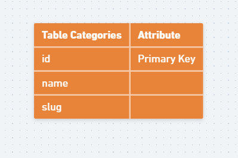

Bagaimana agar nantinya setiap postingan memiliki sebuah category? misalkan terdapat postingan dengan category `Web Programming`, ada yang category nya `Networking` ataupun `SysAdmin` misalkan.

#### Data Definition

Nah cara yang pertama kita harus hubungkan terlebih dahulu dari sisi data definition nya, biasanya dengan cara kita menambahkan sebuah `Foreign Key`

> **Catatan**:
>
> Disini membaca relasi nya biasanya dimulai dari tabel yang menitipkan `Foreign Key` nya, atau jika dari gambar dibawah ini, `tabel categories memiliki relasi ke tabel posts`

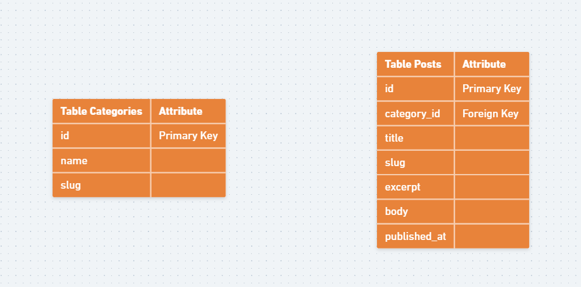

Dengan memasang sebuah foreign key, maka tabel category sekarang bisa be-relasi dengan tabel posts. Setelah menambahkan data definition nya, kita juga harus menentukan cardinality atau kardinalitas atau hubungan antar tabel nya, apakah One To One, One To Many, Many To Many, dan sebagainya.

#### Cardinality Categorys dan Posts

Nah disini kita ingin, satu category bisa memiliki banyak post, karena kan pasti nantinya postingan yang kita tulis itu banyak mungkin 10 post yang dimana misalkan 3 diantaranya mengenai `Web Programming`, 5 diantranya mengenai `Netwokring` dan 2 diantaranya mengenai `SysAdmin`.

Sehingga bisa kita definisikan, satu category bisa memiliki banyak post (jika kita lihat dari sisi category). Maka sekarang kardinalitas nya adalah `One To Many atau satu ke banyak atau 1 ke n` atau jika disimpulkan "1 category memiliki banyak post"

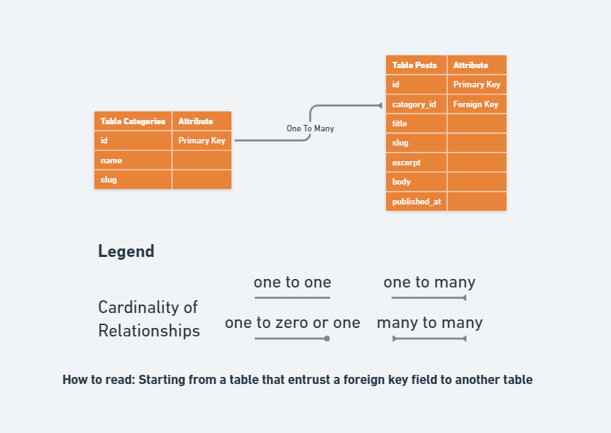

#### Cardinality Invers Posts dan Categorys

Nah selanjutnya, kardinalitas tersebut mempunyai kebalikannya juga atau disebut `Cardinality (Inverse)` pada Eloquent, sehingga POV atau sudut pandang nya sekarang dibalik, yang sebelumnya kita lihat dari sisi `categories > posts` sekarang kita lihat dari sisi `posts > categories`

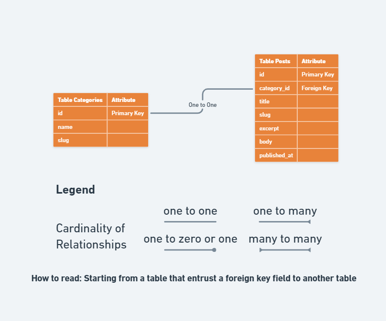

Disini kita ingin "1 post itu hanya memiliki 1 category" sehingga tidak boleh ada 1 post yang memiliki lebih dari 1 category, misalkan `Web Programming` iya `Networking` juga iya, nah hal tersebut tidak boleh. Sehingga kardinalitas dari sisi `posts` ke `categories` adalah `One to One` atau jika disumplkan "1 post dimiliki oleh 1 category"

### Istilah Relationship Pada Eloquent

Nah setelah kita mengentahui kardinalitas dari tabel nya, sekarang istilah tersebut atau penamaan dari kardinalitas nya menjadi berbeda pada eloquent.

### hasMany

Relasi pada tabel categories ke tabel posts sebelumnya adalah `One To Many` nah hal tersebut jika dibaca pada Eloquent adalah `hasMany`

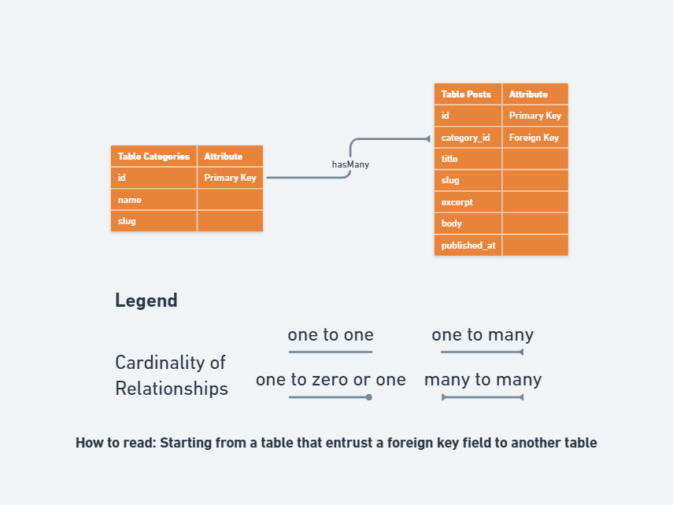

### belongsTo

Relasi pada tabel posts ke tabel categories atau Cardinality Invers sebelumnya adalah `One To One` nah hal tersebut jika dibaca pada Eloquent adalah `belongsTo`

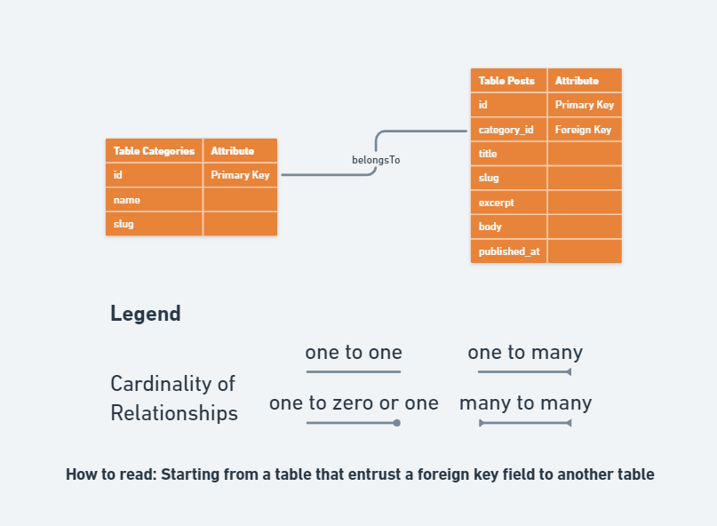

> **Catatan**:
>
> Namun relationship pertama atau utama nya adalah yang tabel `categories` ke tabel `posts`, makanya tabel categories yang memiliki `hasMany`. Kalo misalkan dari `categories` ke tabel `posts` ini `One To One` bukan `One To Many` maka tulis nya `hasOne`. Jika dari `posts` ke `categories` ini `One To Many` bukan `One To One` maka tulis nya `belongsToMany`.

### Studi Kasus Kedua Relationship Pada Sistem Blog


> **Catatan**:
>
> Perhatikan cara penulisan foreign key nya, default nya adalah versi `Singular` dari nama tabel dengan akhiran `_id`. Kalian boleh menggunakan nama lain, namun harus dikasis tahu nantinya ke Laravel nya, namun jika ingin gampang langsung aja kasih versi singular dengan akhiran \_id.
>
> Sebagai contoh tabel Categories tadi ketika menjadi foreign key `category_id` atau tabel Users menjadi `user_id`.

Ceritanya akan kita hubungkan lagi tabel post yang kita punya ke tabel user. Jadi postingan yang ditulis nanti pasti ada user yang menulis nya. Oleh karena itu kita sisipkan foreign key baru yaitu `user_id` di tabel post.

Kira-kira menurut kalian tabel diatas kardinalitas nya apa?

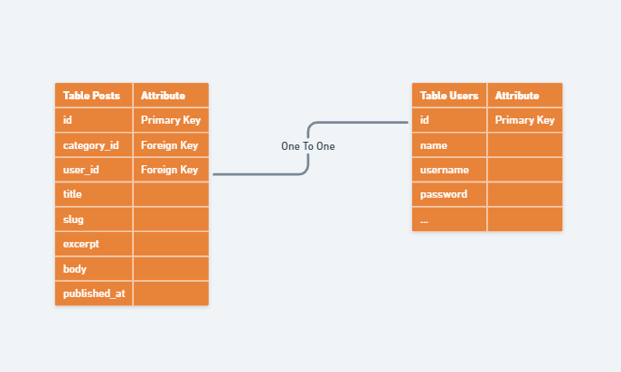

Nah dari posts ke users ternyata relasi nya adalah `One To One`. Mengapa? karena satu postingan itu dimiliki oleh satu user.

Bagaimana dengan kardinalitas invers nya?


Ternyata kardinalitas invers nya dari tabel users ke tabel posts adalah `Many To One`. Mengapa? karena satu user bisa memiliki banyak postingan.

Sebetulnya sama saja, namun disini dibalik posisi tabel nya yang dimana tabel yang memuat foreign key nya disimpan di sebelah kiri. Inti dari kardinalitas nya berada di tabel `users` karena dia yang menitipkan foreign key nya di tabel `posts`.

Nah, pertanyaan nya sekarang, apa nama kardinalitas pada Eloquent nya?

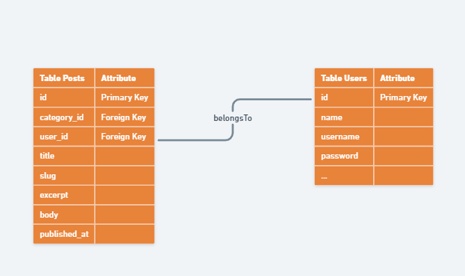

Nama kardinalitas dari posts ke users adalah `belongsTo`. Jadi, `one post belongsTo one user`.

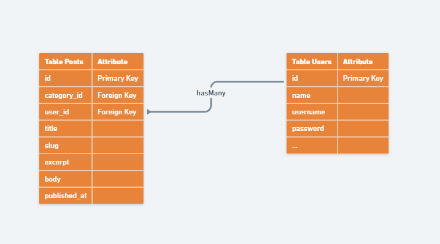

Kalo kebalikan nya yaitu dari users ke posts adalah `hasMany`. Jadi, `one user hasMany posts`

### Studi Kasus Ketiga Relationship Pada Sistem Blog

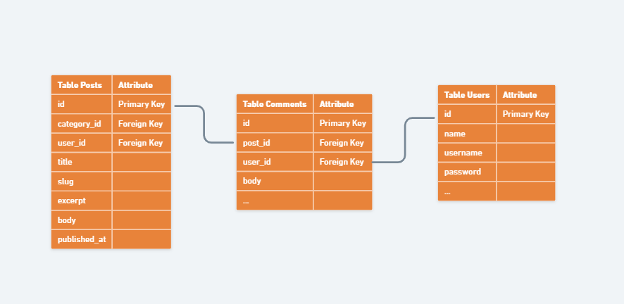

Nantinya, aplikasi kita mempunyai fitur sebuah komen, yang dimana pada tabel `comments` nya itu terdapat field-field tersebut. Sekarang kalian tebak apa kardinalitas antar relasi tabel tersebut?

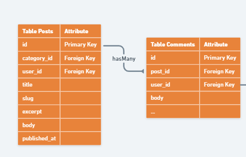

Kardinalitas dari tabel `Posts` ke tabel `Comments` adalah `hasMany` atau `One To Many`. Jika dalam kalimat `One Posts hasMany Comments`.


Jika kita balik atau kardinalitas invers nya dari tabel `Comments` ke tabel `Posts` adalah `belongsTo` atau `One To One`. Jika dalam kalimat `One Comments belongsTo One Post` sehingga satu komen itu pasti ada di satu postingan. Karena setiap komentar di tiap postingan meskipun tulisan nya sama atau user nya sama, pasti `id` nya berbeda. Oleh karena itu satu komentar itu pasti spesifik hanya dimiliki oleh satu postingan.

Sekarang kardinalitas untuk yang users bagaimana?


Kardinalitas dari tabel `Comments` ke tabel `Users` adalah `belongsTo` atau `One To One`. Jika dalam kalimat `One Comments belongsTo One Users`. Sehingga pasti satu komen ditulis sama satu user.

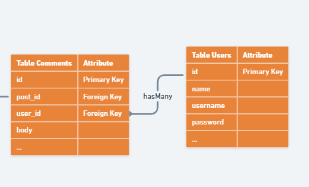

Nah untuk kardinalitas invers nya dari tabel `Users` ke tabel `Comments` adalah `hasMany` atau `One To Many`. Jika dalam kalimat `One Users hasMany Comments`. Jadi boleh saja dalam postingan yang sama, satu user menuliskan komen secara berulang-ulang.

## Pengecekan Eloquent Relationship

Sekarang kita buka file model `Post` agar dapat terhubung dengan model `Category`, kemudian tambahkan method `category` berikut ini didalam class nya

> **Catatan**:
>
> Nama method disini gunakan dengan nama model yang akan dijadikan relasi. Method tersebut akan mengembalikan relasi dari model `Post` terhadap model `Category` yaitu belongsTo. Misalkan, satu postingan itu punya satu category.

```php
class Post extends Model
{
    use HasFactory;

    // protected $fillable = ['title', 'excerpt', 'body'];
    protected $guarded = ['id'];

    public function category()
    {
        return $this->belongsTo(Category::class);
    }
}
```

Nah sekarang model `Post` sudah berelasi ke model `Category`. Bagaimana cara mengeceknya? kita bisa kembali ke tinker nya kemudian restart session shell nya dengan cara exit dan masuk kembali.

Sekarang misalkan kita ambil salah satu postingan pertama nya dengan perintah

```php
$post = Post::first();
```

Maka akan muncul data nya

```php
[!] Aliasing 'Post' to 'App\Models\Post' for this Tinker session.
= App\Models\Post {#6831
    id: 1,
    category_id: 1,
    title: "Judul Pertama",
    slug: "judul-pertama",
    author: "Arman Dwi Pangestu",
    excerpt: "Lorem ipsum dolor sit amet consectetur adipisicing elit",
    body: "<p>Lorem ipsum dolor sit amet consectetur adipisicing elit. Id veritatis reprehenderit eveniet ducimus rerum asperiores temporibus ipsa neque. Eum accusamus ea expedita perferendis quibusdam modi tempore, magnam sapiente ad laudantium amet alias ipsam minus totam nemo iusto itaque voluptates nostrum earum saepe quo, maxime aliquid. Minima voluptatem et totam laborum nam eos, enim odit aperiam necessitatibus eligendi eius rerum minus ipsum! Repudiandae, nam quam? Eius dolores incidunt aut nobis cumque illum id sunt at provident ducimus animi non.</p><p>harum accusantium itaque sit quo doloremque? Officiis perspiciatis recusandae velit maxime delectus at quisquam accusamus explicabo animi fugiat odit, rerum, eligendi similique cum fuga dignissimos voluptatem! Hic illo fugit voluptatum ipsam placeat voluptatibus atque, vero veniam illum cupiditate est laborum suscipit voluptatem optio sunt animi accusantium voluptate, nihil, facere dolores ratione sapiente delectus? Dicta fugiat itaque quaerat accusantium architecto voluptatem omnis aperiam laborum sint, ullam similique enim, maiores libero id qui doloremque!</p>",
    publish_at: null,
    created_at: "2023-12-24 14:52:49",
    updated_at: "2023-12-24 14:52:49",
  }
```

Nah jika kalian melakukan relasi nya sudah benar, maka jika kalian mengetikan perintah ini

> **Catatan**:
>
> Property `category` disini artinya akan menjalankan method `category` yang sudah kita buat sebelumnya di model `Post` kemudian akan otomatis dicarikan category yang sesuai.

```php
$post->category;
```

Maka sekarang akan muncul keseluruhan data category dari postingan pertama tersebut

```php
= App\Models\Category {#7090
    id: 1,
    name: "Programming",
    slug: "programming",
    created_at: "2023-12-24 14:41:06",
    updated_at: "2023-12-24 14:41:06",
  }
```

Sehingga jika kita hanya ingin mengetahui postingan tersebut category nya apa, kita bisa jalankan perintah berikut ini

```php
$post->category->name;
```

Maka akan muncul nama category nya

```php
= "Programming"
```

Ajaib bukan? sekarang kita tidak perlu lagi melakukan join secara manual karena Laravel atau Eloquent yang melakukannya dibelakang layar.

## Implementasi Eloquent Relationship

Setelah mengetahui bagaimana cara nya relationship bekerja pada Eloquent, sekarang waktunya kita implementasikan kedalam sistem blog kita. Misalkan ketika kita meng-klik satu judul postingan, nantinya dibawah tulisan title nya terdapat tulisan oleh siapa dan pada category apa. Untuk contoh nya bisa lihat gambar dibawah ini


Cara nya bagaimana? kita buka file single post view nya yaitu `post.blade.php` agar menampilkan data author dan category dari database nya

```php
@extends('layouts.main')

@section('container')
    <article>
        <h2>{{ $post->title }}</h2>
        <h5>By: {{ $post->author }} in {{ $post->category->name }}</h5>
        {!! $post->body !!}
    </article>

    <a href="/posts">Back to Posts</a>
@endsection
```

Maka sekarang muncul tulisan category nya berdasarkan relasi antara model Post dan model Category. Selanjutnya, bagaimana caranya agar tulisan category tersebut bisa di klik? sehingga ketika di klik dia akan menampilkan postingan blog yang serupa sesuai dengan category yang di klik.

Cara agar feature tersebut berjalan, kita bungkus dulu tulisan category tersebut kedalam tag `a` atau anchor yang lokasi atau href nya adalah ke slug dari category nya seperti berikut ini `/categories/{$post->category->slug}`

```php
@extends('layouts.main')

@section('container')
    <article>
        <h2>{{ $post->title }}</h2>
        <h5>By: {{ $post->author }} in <a href="/categories/{{ $post->category->slug }}">{{ $post->category->name }}</a></h5>
        {!! $post->body !!}
    </article>

    <a href="/posts">Back to Posts</a>
@endsection
```

Sekarang jika kita hover atau preview link dari tulisan category nya, maka akan muncul seperti gambar berikut ini

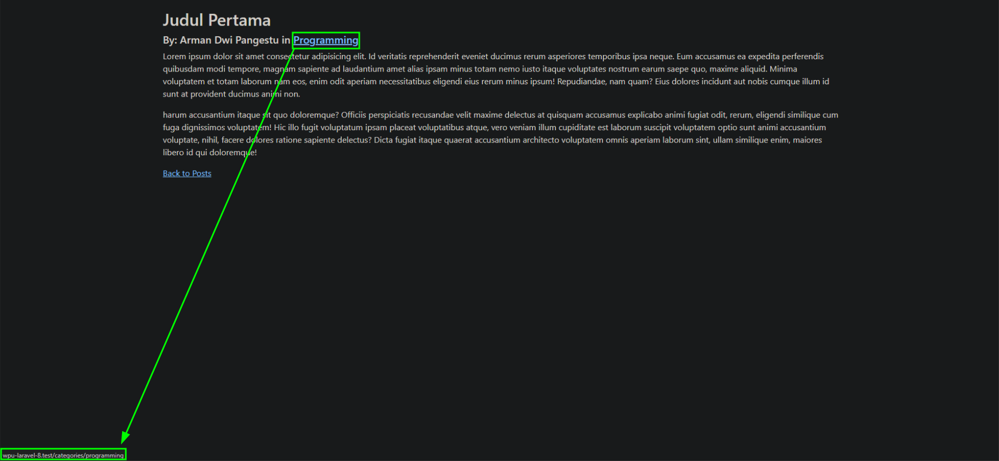

Jika kalian mencoba klik, maka akan muncul view 404 not found karena route nya belum kita tangani, kita coba buat route baru untuk menangani hal tersebut di file `web.php` dengan closure dan route model binding (untuk dijadikan controller nya belakang)

```php
Route::get('/categories/{category:slug}', function (Category $category) {
    return view('category', [
        'title' => $category->name,
        'posts' => $category->posts,
        'category' => $category->name
    ]);
});
```

Setelah route sudah ready, kita siapkan view nya dengan membuat file baru `category.blade.php` dengan isian kita contoh dari view `posts.blade.php`

```php
@extends('layouts.main')

@section('container')
    <h1 class="mb-5">Post Category : {{ $category }}</h1>

    @foreach ($posts as $post)
        <article class="mb-5">
            <h2>
                <a href="/posts/{{ $post->slug }}">{{ $post->title }}</a>
            </h2>
            <h5>By: {{ $post->author }}</h5>
            <p>{{ $post->excerpt }}</p>
        </article>
    @endforeach
@endsection
```

Jika sekarang kita coba buka route category tersebut, maka akan muncul error `foreach()` pada data `$posts` nya

```php
ErrorException
foreach() argument must be of type array|object, null given (View: D:\Documents\Repository\arman\wpu-laravel-8\resources\views\category.blade.php)
```

Mengapa tidak ada isinya? karena kita belum balikin relasi nya atau kardinalitas invers nya. Untuk melakukannya sekarang buka model `Category.php` nya kemudian tambahkan method `posts` seperti berikut ini

```php
class Category extends Model
{
    use HasFactory;

    protected $guarded = ['id'];

    public function posts()
    {
        return $this->hasMany(Post::class);
    }
}
```

Maka sekarang feature tersebut sudah jalan, untuk mengecek nya kalian bisa pergi ke route slug category tersebut atau kita coba dengan tinker

```php
$category = Category::first();
$category->posts;
```

Maka sekarang akan muncul postingan-postingan berdasarkan category pertama

```php
= Illuminate\Database\Eloquent\Collection {#6943
    all: [
      App\Models\Post {#7093
        id: 1,
        category_id: 1,
        title: "Judul Pertama",
        slug: "judul-pertama",
        author: "Arman Dwi Pangestu",
        excerpt: "Lorem ipsum dolor sit amet consectetur adipisicing elit",
        body: "<p>Lorem ipsum dolor sit amet consectetur adipisicing elit. Id veritatis reprehenderit eveniet ducimus rerum asperiores temporibus ipsa neque. Eum accusamus ea expedita perferendis quibusdam modi tempore, magnam sapiente ad laudantium amet alias ipsam minus totam nemo iusto itaque voluptates nostrum earum saepe quo, maxime aliquid. Minima voluptatem et totam laborum nam eos, enim odit aperiam necessitatibus eligendi eius rerum minus ipsum! Repudiandae, nam quam? Eius dolores incidunt aut nobis cumque illum id sunt at provident ducimus animi non.</p><p>harum accusantium itaque sit quo doloremque? Officiis perspiciatis recusandae velit maxime delectus at quisquam accusamus explicabo animi fugiat odit, rerum, eligendi similique cum fuga dignissimos voluptatem! Hic illo fugit voluptatum ipsam placeat voluptatibus atque, vero veniam illum cupiditate est laborum suscipit voluptatem optio sunt animi accusantium voluptate, nihil, facere dolores ratione sapiente delectus? Dicta fugiat itaque quaerat accusantium architecto voluptatem omnis aperiam laborum sint, ullam similique enim, maiores libero id qui doloremque!</p>",
        publish_at: null,
        created_at: "2023-12-24 14:52:49",
        updated_at: "2023-12-24 14:52:49",
      },
    ],
  }
```

## Menambahkan Routes Untuk Semua List Categories

Setelah sebelumnya kita membuat feature postingan berdasarkan category, sekarang kita buat feature untuk melihat list-list categories apa saja yang tersedia. Caranya kita buat route baru di file `web.php`

```php
Route::get('/categories', function () {
    return view('categories', [
        'title' => 'Post Categories',
        'categories' => Category::all()
    ]);
});
```

Setelah routes nya tersedia, sekarang kita buat view file nya `categories.blade.php` dengan isian nya kita copy dari file `category.blade.php`

```php
@extends('layouts.main')

@section('container')
    <h1 class="mb-5">Post Categories</h1>

    @foreach ($categories as $category)
        <ul>
            <li>
                <h2>
                    <a href="/categories/{{ $category->slug }}">{{ $category->name }}</a>
                </h2>
            </li>
        </ul>
    @endforeach
@endsection
```

Nah maka jika sekarang kita arahkan URL nya agar mengarah ke routes `/categories` maka akan muncul list-list category nya seperti gambar dibawah ini


